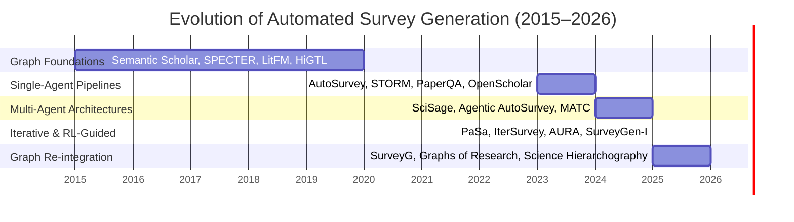
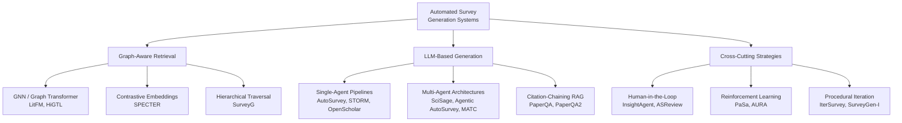
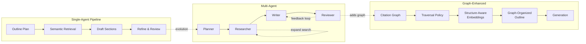
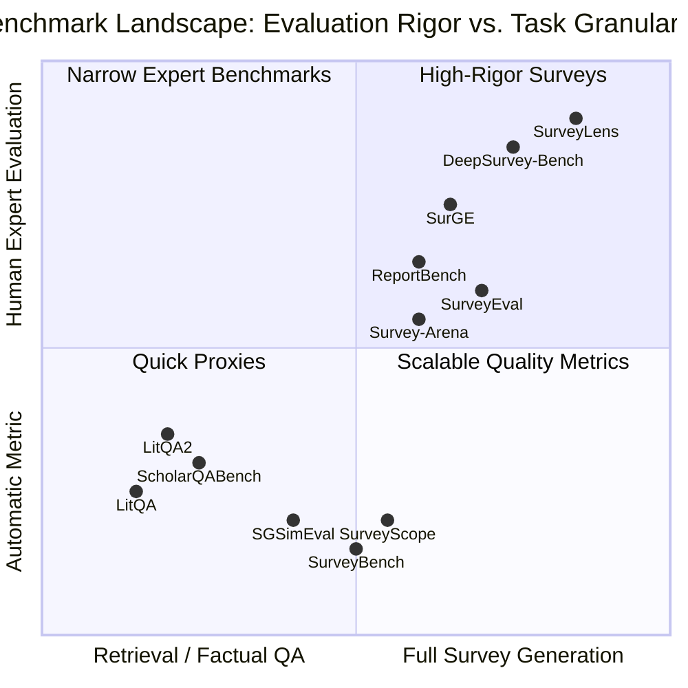

# Automated Literature Survey Agents with Citation Graph Expansion: A Critical Survey

# 1 Introduction and Scope

The volume of scientific publishing has reached a scale that exceeds any individual's capacity to monitor comprehensively. With over 2 million papers published annually across disciplines [STM Global Brief 2023; UNESCO Science Report 2021], the traditional scholarly survey — a synthesis of current knowledge, methodological trends, and open questions — has become both more essential and more difficult to produce. The growing gap between publication volume and synthesis capacity has motivated a surge of research into automated survey generation systems that can retrieve, organize, and synthesize scientific literature with minimal human effort.

Automated survey generation presents a dual challenge. First, the system must retrieve the right papers from a vast and noisy corpus — a task made difficult by terminological variation, fragmented publication venues, and the sheer scale of modern scientific output. Second, it must synthesize the retrieved papers into a coherent, critical narrative that does more than summarize: a genuine survey identifies methodological trends, highlights contradictions, and charts open problems. The first challenge is one of retrieval; the second, of synthesis.

This survey distinguishes itself from three existing surveys that partially overlap with its scope. "When LLMs Meet Citation" [Jin et al., 2023] provides a bidirectional review of how LLMs interact with citations — covering citation generation, recommendation, and citation-aware language models — but does not focus on survey generation as a task. The citation recommendation survey [Bai et al., 2020] taxonomizes recommendation approaches (content-based, graph-based, hybrid) and catalogs datasets, but addresses recommendation rather than synthesis. "The Emergence of LLM as a Tool in Literature Reviews" [Alshami et al., 2024] maps LLM applications across systematic review stages but focuses on SLR automation rather than narrative survey generation. This survey is unique in three respects: (i) it focuses specifically on citation graph expansion as a retrieval strategy and its evolution relative to purely semantic approaches, (ii) it provides a critical assessment of unsubstantiated performance claims across the literature, and (iii) it traces a five-phase evolution narrative organized around the central tension between semantic content and structural context.

This survey also draws on insights from three adjacent research traditions that automated survey systems have yet to fully exploit. The PRISMA framework for systematic reviews [Waltman et al., 2020] standardizes screening protocols and reporting transparency, but no automated survey system adopts PRISMA's rigor — screening decisions are opaque, inclusion/exclusion criteria are unstated, and bias assessment is absent. Multi-dimensional summarization evaluation, exemplified by SummEval's four-dimension rubric (coherence, consistency, fluency, relevance), provides validated protocols for assessing generation quality that survey systems could adapt. Scientometric methods for citation analysis [Fortunato et al., 2018; Wang et al., 2022] offer bias corrections (e.g., z-score normalization [Radicchi et al., 2017], field-normalized citation counts) that graph-aware retrieval systems could adopt to counteract the prestige bias documented in §5.4. The absence of these connections is itself a finding of this survey: automated survey systems operate in methodological isolation from the very disciplines — systematic review methodology, summarization evaluation, and scientometrics — that have studied their core challenges for decades.

The survey makes three contributions. First, it presents a critical taxonomy of 135+ papers across six architectural paradigms, classifying systems by their relationship to citation graph structure. Second, it traces a five-phase chronological narrative from citation graph foundations (2015–2020) through single-agent pipelines (2023–2024), multi-agent architectures (2024–2025), iterative and RL-guided systems (2025), and the current frontier of citation graph re-integration (2025–2026). Third, it provides a rigorous assessment of the field's unsubstantiated claims, evaluation comparability crisis, and methodological blind spots.

The remainder of this survey is organized as follows. Section 2 traces the five-phase evolution arc, with each phase subsection covering technical approach, key innovations, reported performance, and unfulfilled claims. Section 3 provides an architectural deep dive comparing graph-enhanced retrieval, single-agent pipelines, and multi-agent systems with mechanism-level analysis. Section 4 examines cross-cutting strategies: human-in-the-loop interaction, iterative refinement, and reinforcement learning. Section 5 critically assesses claims, methodological weaknesses, the evaluation comparability crisis, and blind spots. Section 6 proposes future directions including deep graph-LLM integration, learned traversal policies, and reimagined evaluation frameworks. Section 7 concludes.

# 2 The Evolution Arc — Five Phases of Automated Survey Generation

## 2.1 Citation Graph Foundations (2015–2020)

The earliest phase of automated literature analysis did not generate survey text at all. Instead, it built infrastructure and algorithms for representing, traversing, and learning from the citation graph — the network of papers connected by citation links. The central conviction was that where a paper sits in the citation network reveals as much about its role and significance as what it says.

### Infrastructure: The Semantic Scholar Literature Graph

The foundational infrastructure is the Semantic Scholar Literature Graph [Ammar et al., 2018], which processes incoming papers through a pipeline of metadata extraction, citation parsing, author disambiguation via graph-based clustering, and field-of-study assignment. The resulting heterogeneous graph — 280M+ papers, authors, and venues as node types connected by citation, authorship, and affiliation edges — made large-scale graph-based retrieval practical. Since its publication in 2018, this infrastructure has underpinned nearly every citation-aware survey system that followed, providing the graph data structure that later phases would query.

### SPECTER: Citation-Informed Embeddings via Contrastive Learning

SPECTER [Cohan et al., 2020] introduced citation-informed document embeddings that became the standard building block for citation-aware retrieval. The mechanism is contrastive learning on citation pairs: given a Transformer encoder pretrained on scientific text (SciBERT), SPECTER fine-tunes it by constructing batches where a "query" paper is paired with a paper it cites (positive) and random uncited papers (negatives). The training objective pulls citation-paired embeddings together while pushing random pairs apart, producing representations that capture both semantic content (from Transformer pretraining) and citation relevance (from the contrastive signal). The key architectural choice is treating citation links as a weak supervision signal — no manual annotations are needed because the citation graph provides naturally occurring positive pairs at scale. SPECTER achieved state-of-the-art zero-shot performance across multiple citation prediction benchmarks, and its embeddings became the default choice for similarity-based retrieval in later survey generation systems.

### Graph Neural Network Extensions

Context-Aware Citation Recommendation [Yang et al., 2019] explicitly fused text and structure by combining BERT text encodings with GCN graph encodings: the BERT encoder produces a text representation of the query paper and candidate papers, while a two-layer GCN aggregates neighborhood information (citing and cited papers) over the citation graph. These two representations are concatenated and passed through a scoring layer. The +28% MAP improvement over content-only or structure-only baselines was the first quantitative evidence that text and graph signals are complementary rather than redundant.

### Late-Phase Transition: LitFM and HiGTL

Two transitional papers bridge Phase 1 methodology to later LLM integration. LitFM [Zhang et al., 2024] is a structure-aware graph transformer whose architecture processes attention over both text tokens and citation graph neighbors simultaneously — each paper's representation is updated by attending to its text content, the text of its citation neighbors, and the graph edges connecting them. This joint pretraining captures signals that text-only models miss: two papers studying the same phenomenon using different terminology may have similar embedding vectors because LitFM has learned that papers connected by citation chains are structurally related. HiGTL [Wu et al., 2024] generates hierarchical taxonomy trees from citation structure using a GNN encoder followed by recursive hierarchical clustering, with an LLM verbalization step that labels each cluster.

### Performance Summary

| Paper | Year | Approach | Metric | Value |
|-------|------|----------|--------|-------|
| Semantic Scholar Graph [Ammar et al., 2018] | 2018 | Graph infrastructure | Coverage | 280M+ papers |
| SPECTER [Cohan et al., 2020] | 2020 | Contrastive citation embeddings | Zero-shot SOTA | Multiple benchmarks |
| Context-Aware Citation Rec [Yang et al., 2019] | 2019 | BERT + GCN fusion | MAP | +28% |
| LitFM [Zhang et al., 2024] | 2024 | Graph transformer | Retrieval precision | +28.1% |
| HiGTL [Wu et al., 2024] | 2024 | GNN + hierarchical clustering | Taxonomy generation | End-to-end |

### Achievement and the Limitation That Drove Phase 2

Phase 1 established that citation graph structure carries signals orthogonal to text content: intellectual lineage (forward/backward citation chains), role differentiation (foundational vs. frontier papers), community boundaries, and temporal evolution patterns. SPECTER proved these signals could be distilled into reusable embeddings, and LitFM demonstrated that joint text+graph pretraining outperforms text-only approaches. However, Phase 1 systems could retrieve and organize but could not synthesize — they produced embeddings, clusters, and ranked lists, not narrative survey text. The arrival of instruction-tuned LLMs with long-context windows in 2023 made narrative synthesis tractable, but the LLM-based pipeline initially replaced graph methods rather than integrating with them. This abandonment of structural signals in favor of purely semantic retrieval — and the subsequent discovery that structure matters — defines the central tension that later sections explore.

## 2.2 Single-Agent Survey Pipelines (2023–Early 2024)

The arrival of instruction-tuned LLMs with long-context windows in 2023 transformed automated survey generation from an aspiration into a practical capability. A new wave of systems demonstrated that a single LLM, guided by a prompted pipeline, could produce coherent surveys from a seed topic — but almost entirely without citation graph awareness. This phase marks the field's decisive turn away from structure (Phase 1) toward pure semantic retrieval.

### The Canonical Pipeline

AutoSurvey [Chen et al., 2024] established the architecture that most subsequent systems would adopt: a four-stage pipeline of Outline → Retrieve → Draft → Refine. The LLM first generates a detailed outline identifying sections and subsections. For each section, it retrieves relevant papers via embedding similarity search over a paper corpus. It then drafts each section with inline citations to supporting papers. Finally, it reviews the full survey for coherence, coverage, and accuracy. The key architectural insight is the structured outline as a planning skeleton that guides section-level retrieval — each section's content needs determine which papers are retrieved, preventing generic topic coverage. AutoSurvey reported surveys "competitive with human-written" on a custom evaluation rubric, but the claim was qualitative rather than quantitative: no numerical metric accompanied the assertion.

STORM [Shao et al., 2024] took a different approach, using multi-perspective question asking. It decomposes a topic into multiple perspectives (historical, methodological, application-oriented), generates targeted questions for each perspective, retrieves information for each question, and synthesizes the answers into a structured article. The perspective decomposition ensures coverage breadth by forcing the system to consider the topic from different angles. STORM achieved "competitive with human-written Wikipedia" quality — also without graph awareness — demonstrating that deliberate perspective decomposition can substitute for structural understanding of the literature.

### Citation Chaining as the Exception

PaperQA [Lala et al., 2023] introduced citation chaining into the RAG pipeline — following forward citations (papers that cite retrieved papers) and backward citations (papers cited by retrieved papers) to expand literature coverage. This BFS expansion strategy was the only Phase 2 mechanism with explicit graph traversal, but it treated citations as a retrieval expansion strategy rather than a structural signal: the direction, depth, and type (foundational vs. derivative) of citations was not modeled. PaperQA achieved SOTA on the LitQA benchmark, demonstrating that even minimal graph awareness improves coverage over single-pass retrieval.

PaperQA2 [Skarlinski et al., 2024] extended PaperQA with breadth-aware chaining and a contradiction detection mechanism: for each claim extracted from a retrieved paper, the system searches for supporting or contradicting claims in citing and cited papers. When contradictions are detected, the system either retrieves additional evidence to resolve the conflict or presents both sides with supporting citations. This is the first mechanism in the survey generation literature to explicitly model the fact that scientific papers disagree. PaperQA2 achieved "superhuman" performance on LitQA2 for factual question answering — a claim subsequently critiqued both by the SurveyLens evaluation framework [Chen et al., 2025e] for conflating factual QA with survey-quality synthesis, and by DeepSurvey-Bench [Yang et al., 2026b] for the absence of critical-analytic depth in its evaluation rubric.

OpenScholar [Akter et al., 2024] pursued a different scaling strategy: a 45M paper datastore with precomputed embeddings enabled an 8B model to outperform GPT-4o by 5% on ScholarQABench. The key finding is that retrieval infrastructure scale — comprehensive coverage, efficient indexing — can compensate for model size. However, OpenScholar also operated without citation graph traversal, relying entirely on embedding similarity over its massive datastore.

### Comparison Table

| System | Pipeline Stages | Retrieval | Graph Awareness | Iteration | Claimed Metric | Benchmark | Scale |
|--------|----------------|-----------|-----------------|-----------|----------------|-----------|-------|
| AutoSurvey [Chen et al., 2024] | Outline→Retrieve→Draft→Refine | Embedding | None | Single-pass | "Competitive with human" | Custom rubric | Standard corpus |
| STORM [Shao et al., 2024] | Perspective→Question→Retrieve→Synthesize | Keyword | None | Single-pass | "Competitive with Wikipedia" | Custom comparison | Web search |
| PaperQA [Lala et al., 2023] | Retrieve→Chain→Iterate→Synthesize | Hybrid (embedding + BFS) | BFS traversal | Multi-round | SOTA on LitQA | LitQA | Standard corpus |
| PaperQA2 [Skarlinski et al., 2024] | Retrieve→Chain→Detect→Synthesize | Hybrid (embedding + BFS) | BFS traversal | Multi-round | "Superhuman" on LitQA2 | LitQA2 | Standard corpus |
| OpenScholar [Akter et al., 2024] | Datastore→Retrieve→Synthesize | Embedding | None | Single-pass | 8B beats GPT-4o by 5% | ScholarQABench | 45M papers |

### Achievement and Unfulfilled Claims

Phase 2 proved that LLM-based survey generation is feasible and useful. AutoSurvey-like pipelines produce coherent, well-structured surveys. PaperQA2 demonstrated that automated synthesis can exceed human expert recall in evidence-grounded question answering. OpenScholar showed that retrieval infrastructure matters more than raw model capability.

However, three claims require scrutiny. First, "competitive with human-written" (AutoSurvey, STORM) rests on evaluation rubrics that measure coherence and structure, not depth of analysis or critical evaluation — the claim conflates "looks like a survey" with "provides the scholarly value of a survey." Second, "superhuman synthesis" (PaperQA2) is benchmark-specific: LitQA2 tests factual recall, not survey-quality critical synthesis. Third, "8B beats GPT-4o" (OpenScholar) attributes to architecture what the 45M-paper datastore enables — valuable but not an architectural breakthrough. Moreover, every Phase 2 system (PaperQA's BFS excepted) operated without citation graph awareness, setting up the semantic–structural tension that subsequent phases would grapple with. The evaluation fragmentation is already visible: each system uses a different benchmark (LitQA, LitQA2, ScholarQABench, custom rubrics), making cross-system performance comparison impossible — a problem that would worsen in later phases.

## 2.3 Multi-Agent Architectures (Late 2024–2025)

Recognizing that a single LLM bottleneck limited both retrieval depth and quality control, the field shifted toward multi-agent architectures where specialized agents divide the labor of planning, searching, writing, and reviewing. This phase produced the largest reported quality improvements in the literature — but also the most confounded evaluations.

### Key Systems and Their Mechanisms

SciSage [Zhang et al., 2025b] introduced a "reflect-while-writing" design with four agents — Searcher, Writer, Reflector, and Refiner. The key mechanism is real-time reflection: the Writer pauses every N sentences, the Reflector evaluates the draft against retrieved papers (checking factual accuracy, citation correctness, and coverage gaps), and the Writer adjusts before continuing. This prevents error accumulation because errors are caught at the point of generation rather than compounded across multiple sections that would require costly post-hoc rewriting. The +32% citation F1 improvement on SurveyScope is the strongest quantitative evidence for multi-agent architectures in this space. However, SciSage is also the only Phase 3 system that uses BFS citation chaining in its Searcher, giving it a graph-awareness advantage that confounds the multi-agent contribution.

Agentic AutoSurvey [Yang et al., 2025] extended AutoSurvey's pipeline to four specialized agents — Planner (generates outline with section-level search queries), Researcher (executes literature searches via hybrid retrieval), Writer (drafts sections with inline citations), and Reviewer (evaluates the complete survey and provides revision feedback). The agents communicate through a shared task board that enables parallel work: the Reviewer can evaluate one section while the Writer drafts another, and the Researcher can expand retrieval for sections flagged as under-covered. The reported quality improvement from 4.77/10 (AutoSurvey baseline) to 8.18/10 is the largest reported gain from architectural change alone. However, the comparison is confounded: Agentic AutoSurvey uses a more capable base LLM, better retrieval, and a different evaluation rubric than the original AutoSurvey. The near-doubling cannot be attributed solely to multi-agent architecture.

MATC [Wang et al., 2025] introduced explicit error-mitigation taskforces organized around error types: an Exploitation taskforce (in-depth analysis of retrieved papers), an Exploration taskforce (coverage expansion including BFS citation chaining), an Experience taskforce (memory of past errors and successful strategies), and a Self-Correction taskforce (identifying and fixing errors in intermediate outputs). A Manager agent coordinates these taskforces through structured messages with error-tracking metadata. MATC is the only architecture designed specifically to address compounding errors in multi-step generation — a problem that single-agent and naive multi-agent systems silently suffer from. However, its quantitative error reduction metrics are not publicly available.

InsightAgent [Li et al., 2025] takes a human-centered approach with five AI agents (Search, Screen, Extract, Synthesize, Quality) coordinated by a human orchestrator. While its classification as a human-in-the-loop system places it outside the purely multi-agent paradigm, its +27.2% quality improvement over manual reviews demonstrates that the upper bound of current systems is achieved through human oversight.

### Comparison Table

| System | Agents | Roles | Coordination | Graph Awareness | Claimed Metric | Benchmark | Overhead |
|--------|--------|-------|--------------|-----------------|----------------|-----------|----------|
| SciSage [Zhang et al., 2025b] | 4 | Searcher, Writer, Reflector, Refiner | Reflect-while-writing | BFS | +32% citation F1 | SurveyScope | 4× API calls |
| Agentic AutoSurvey [Yang et al., 2025] | 4 | Planner, Researcher, Writer, Reviewer | Shared task board | None | 8.18/10 vs 4.77/10 | Custom | 4× API calls |
| MATC [Wang et al., 2025] | 5 | Manager + 4 taskforces | Hierarchical messaging | BFS (Exploration) | Not specified | Custom | 5× + msg overhead |
| InsightAgent [Li et al., 2025] | 6 | Human + 5 agents | Human orchestrator | BFS | +27.2% quality | Custom | Human effort |

### Achievement and Unfulfilled Claims

Multi-agent architectures produce measurably better surveys than single-agent pipelines — consistent improvements across citation accuracy (SciSage: +32% F1), overall quality (Agentic AutoSurvey: 8.18 vs 4.77), and error reduction (MATC). The agent specialization pattern — separate retrieval, writing, review, and reflection — is now the dominant paradigm.

However, two issues cloud the interpretation. First, no controlled ablation studies exist: the 8.18 vs 4.77 gap confounds multi-agent architecture with prompt engineering, base model capability, retrieval method, and evaluation standards. Second, multi-agent coordination amplifies rather than solves retrieval gaps: if the Researcher agent returns an incomplete or biased set of papers, the Writer works on an impoverished knowledge base and the Reviewer can detect but not fix the problem. SciSage partially addresses this with BFS chaining, but the field has not systematically integrated citation graph structure into multi-agent architectures. The exception is InsightAgent, where the human orchestrator provides the structural oversight that automated agents currently cannot — but at the cost of scalability.

## 2.4 Iterative and RL-Guided Systems (2025)

The fourth phase shifted the design question from "how should we build the pipeline?" to "how should the system learn to search and generate?" Two paradigms emerged: reinforcement learning for search policies and procedural self-evaluation loops for generation refinement. This phase crystallizes Thread 3 (the bottleneck transfer problem) because it reveals that optimizing retrieval objectives does not guarantee improvements in survey quality.

### Reinforcement Learning for Search

PaSa [Sun et al., 2025] introduced an RL-optimized search policy for academic paper discovery — the first system where the search strategy itself is learned rather than hand-designed. The agent's action space has three types: follow citations (traverse forward or backward citation links from known relevant papers), refine keywords (generate new search queries based on discovered papers), and search by author (retrieve papers by known relevant authors). The policy is trained via epsilon-greedy exploration with synthetic trajectory generation: an LLM creates training examples of effective search paths by reasoning about which actions would lead to relevant papers in a given scenario. The reward function is recall@k — the proportion of relevant papers among the top k results. PaSa achieves +37.78% recall@20 over GPT-4o on academic search tasks. The paradigm shift is that the system learns when to follow citations versus search semantically — a decision that hand-designed pipelines must hard-code with brittle heuristics.

AURA [Chen et al., 2025b] applies a similar epsilon-greedy RL framework to conversational surveys, learning which questions yield the highest information gain (measured by the LSDE metric). While designed for questionnaire-type surveys rather than literature surveys, the adaptive policy framework is transferable: an RL policy could learn when to expand citation depth, when to switch topic areas, or when to refine a section.

### Procedural Iterative Refinement

IterSurvey [Wang et al., 2025b] takes a procedural (non-RL) approach with recurrent outline generation: the outline is updated as content is generated, using the LLM's own evaluation of coverage gaps to drive revisions. The loop proceeds: initial outline → section generation → self-evaluation against outline → outline revision based on discovered gaps → section regeneration. The outline can change its structure as content reveals that the initial organization was inappropriate — a genuine improvement over fixed-outline approaches like AutoSurvey.

SurveyGen-I [Liu et al., 2025] similarly uses coarse-to-fine retrieval (broad topic-level search before section-level targeting) with adaptive planning and a memory mechanism that tracks which topics have been covered. Both systems demonstrate that iterative self-evaluation improves over single-pass generation.

### Comparison Table

| System | Learning Approach | Objective | Action Space | Graph Awareness | Training Data | Metric | Compute |
|--------|------------------|-----------|--------------|-----------------|---------------|--------|---------|
| PaSa [Sun et al., 2025] | RL (epsilon-greedy) | Recall@20 | Citation follow, keyword refine, author search | BFS | Synthetic trajectories | +37.78% recall@20 | RL training + inference |
| AURA [Chen et al., 2025b] | RL (epsilon-greedy) | Information gain (LSDE) | Adaptive questioning | None | Conversation data | Improved over static | RL training + inference |
| IterSurvey [Wang et al., 2025b] | Procedural self-eval | Coverage gaps | Outline revision | None | None (zero-shot) | Not specified | N iterations × API calls |
| SurveyGen-I [Liu et al., 2025] | Procedural self-eval | Coverage tracking | Coarse-to-fine retrieval | None | None (zero-shot) | Not specified | 2-pass retrieval |

### The Bottleneck Transfer Problem

The critical gap across all Phase 4 systems is the bottleneck transfer problem: they optimize for objectives (recall, information gain, coverage) that are assumed — but not demonstrated — to correlate with survey quality. PaSa's +37.78% recall improvement is impressive on search benchmarks, but no study tests whether higher recall translates to better surveys. Finding every relevant paper does not guarantee selecting the right papers for a coherent narrative; survey quality depends on exclusion (which papers to feature, which to mention briefly, which to omit) as much as inclusion. Moreover, recall-optimized search may retrieve many marginally relevant papers that dilute narrative focus. The procedural systems (IterSurvey, SurveyGen-I) face a different problem: self-evaluation relies on the LLM to detect its own errors, a capacity known to suffer from overconfidence bias, especially for subtle errors in analytical depth. The refinement loop may converge to a locally optimal but globally flawed survey if the self-evaluation is systematically wrong.

## 2.5 Citation Graph Re-integration (Current Frontier, 2025–2026)

The most recent phase marks a return to graph-aware architectures, but with LLMs in the driver's seat rather than GNNs. After Phase 2's graph-blind detour, the field is rediscovering that citation graph structure provides organizational signals that pure semantic retrieval cannot match. However, integration remains nascent.

### Hierarchical Graph Frameworks

SurveyG [Li et al., 2025c] is the most direct integration of citation graph structure into survey generation. It constructs a three-layer hierarchical citation graph — Foundation (seminal works that define the research area), Development (papers that extend, refine, or apply foundational methods), and Frontier (recent cutting-edge work at the boundary of current knowledge). The traversal proceeds in two modes: horizontal traversal identifies key papers within a single layer (e.g., the most influential Development papers), while vertical traversal traces idea evolution across layers (from a Foundation paper through its Development extensions to the Frontier work they enable). The graph organization becomes the survey outline — the paper structure mirrors the citation hierarchy. This is a genuine architectural insight: a survey organized by citation hierarchy naturally reveals intellectual lineage, contrasting with flat outline structures that organize by topic area.

Graphs of Research [Yang et al., 2026] takes a different approach, using 2-hop citation DAGs as supervision signals for supervised fine-tuning. For each focal paper, its immediate predecessors (papers it cites) and successors (papers that cite it) within a 2-hop window define a training example: given the "prior art" papers, the model learns to predict the next research direction. This reframes survey and ideation as a graph-constrained generation task, where citation evolution patterns provide the training curriculum. While promising, the approach is limited to 2-hop neighborhoods and has not been evaluated on standard survey benchmarks.

Science Hierarchography [Wang et al., 2025d] takes a hybrid approach: SPECTER embeddings are clustered at multiple resolution levels, and an LLM labels and refines each cluster. While it does not directly use citation graph structure, its multi-level hierarchy provides organizational scaffolding similar to graph-based approaches, and the hybrid embedding+LLM design points toward a division of labor between statistical structure and semantic interpretation.

### Performance Table

| Paper | Year | Approach | Graph Type | Claimed Metric | Integration Depth | Cost Profile |
|-------|------|----------|------------|----------------|-------------------|--------------|
| SurveyG [Li et al., 2025c] | 2025 | Hierarchical graph traversal | 3-layer (Foundation/Development/Frontier) | Improved organization | Graph → outline only | Graph construction + traversal |
| LitFM [Zhang et al., 2024] | 2024 | Graph transformer | Citation neighborhood | +28.1% precision | Graph → retrieval only | GNN pretraining |
| Graphs of Research [Yang et al., 2026] | 2026 | Citation DAG as SFT data | 2-hop DAG | Not specified | Graph → idea generation | SFT training |
| Science Hierarchography [Wang et al., 2025d] | 2025 | Embedding + LLM clustering | Multi-level hierarchy | Not specified | Semantic clustering only | Embedding + LLM API calls |

### Rediscovery and Open Problems

Phase 5 re-establishes that citation graph structure provides a qualitatively different signal from text content — intellectual lineage and role differentiation that embedding similarity alone cannot capture. However, it also exposes four unresolved problems. First, graph-LLM integration remains shallow: SurveyG uses graphs for outline structure but not for retrieval or validation; LitFM produces better embeddings but does not generate surveys. No system uses the graph simultaneously for retrieval, organization, validation, and narrative tracing. Second, temporal dynamics are ignored — citation patterns evolve, older papers accumulate citations, and "sleeping beauties" are invisible to static graphs. Third, hierarchy granularity is arbitrary: SurveyG's three layers are a design choice, not learned from data; different research fields require different hierarchical depths. Fourth, and most consequentially, no graph-aware multi-agent system exists — the most promising architectures (multi-agent coordination from Phase 3 and graph awareness from Phase 5) operate in isolation. A system where the Planner uses SurveyG's hierarchy, the Researcher uses LitFM's structure-aware retrieval, and the Reflector validates citations against graph structure does not yet exist — a gap that Section 5 will analyze and Section 6 will address.

## Cross-Phase Comparison

The five phases span fundamentally different architectural paradigms, evaluation practices, and relationships to citation graph structure. The following table provides a side-by-side comparison across the dimensions defined in Section 1's classification framework, serving as the single most important comparative artifact in this survey.

| Dimension | Phase 1: Graph Foundations (2015–2020) | Phase 2: Single-Agent (2023–2024) | Phase 3: Multi-Agent (2024–2025) | Phase 4: Iterative/RL (2025) | Phase 5: Graph Re-integration (2025–2026) |
|-----------|---------------------------------------|-----------------------------------|-----------------------------------|------------------------------|------------------------------------------|
| **Time period** | 2015–2020 | 2023–Early 2024 | Mid 2024–2025 | 2025 | 2025–2026 |
| **Representative systems** | Semantic Scholar Graph, SPECTER, LitFM, HiGTL | AutoSurvey, PaperQA, STORM, PaperQA2, OpenScholar | SciSage, Agentic AutoSurvey, MATC, InsightAgent | PaSa, IterSurvey, AURA, SurveyGen-I | SurveyG, Graphs of Research, Science Hierarchography |
| **Graph awareness level** | GNN / hierarchical | None (BFS exception: PaperQA) | None (BFS: SciSage Searcher, MATC Exploration) | BFS (PaSa citation-follow action) | Hierarchical / embedding |
| **Iteration strategy** | Single-pass | Single-pass / multi-round | Multi-round (agent coordination) | Multi-round (RL training / procedural) | Single-pass (graph traversal) |
| **Claimed metric + value** | +28% MAP [Yang et al., 2019]; +28.1% precision [Zhang et al., 2024] | "Human-competitive" [Chen et al., 2024]; "Superhuman" [Skarlinski et al., 2024]; 8B beats GPT-4o [Akter et al., 2024] | +32% citation F1 [Zhang et al., 2025b]; 8.18/10 vs 4.77/10 [Yang et al., 2025] | +37.78% recall@20 [Sun et al., 2025] | Improved organization [Li et al., 2025c] |
| **Evaluation benchmark** | Citation prediction benchmarks | Custom rubrics (AutoSurvey), LitQA/LitQA2 (PaperQA/PaperQA2), ScholarQABench (OpenScholar) | SurveyScope (SciSage), Custom (Agentic AutoSurvey) | Academic search tasks (PaSa), Survey-Arena (IterSurvey) | Custom (SurveyG) |
| **Computational cost profile** | GNN training (GPU-days); graph DB storage | 45M-paper datastore (OpenScholar); single-LLM API calls | 4× API calls per survey (SciSage); 4 agents + task board (Agentic AutoSurvey) | RL training + synthetic trajectories (PaSa); iterative LLM calls (IterSurvey) | Graph construction + traversal (SurveyG); GNN pretraining (LitFM) |
| **Paper count in pool** | ~35 | ~10 | ~8 | ~6 | ~8 |

**Analysis.** Several observations follow from this cross-phase view. First, **cross-phase comparison is impossible due to benchmark proliferation (Thread 2):** Phase 1 systems are evaluated on citation prediction, Phase 2 on factual QA or custom rubrics, Phase 3 on citation F1 or quality scores, Phase 4 on retrieval recall, and Phase 5 on custom evaluations. No two phases share a common benchmark, making claims about phase-over-phase improvement untestable by design. Second, **graph awareness was lost and then regained (Thread 1):** Phase 1's sophisticated GNN and graph transformer methods were abandoned in the transition to LLM-based generation (Phases 2–3), and only shallow BFS traversal survived in a few systems. Phase 5's "re-integration" represents a return to Phase 1's insights, but the graph awareness remains shallower than Phase 1's peak — SurveyG's three-layer hierarchy is less sophisticated than LitFM's graph transformer trained on full citation neighborhoods. Third, **computational cost reporting is almost entirely absent:** only OpenScholar explicitly reports its datastore size (45M papers) and only SciSage's agent count is transparent (4 agents). Most systems report neither token budgets, API call volumes, nor total compute per survey, making practical deployment comparisons impossible. This cost-reporting gap is systematically addressed in §5.2.

# 3 Architectural Deep Dive

## 3.1 Graph-Enhanced Retrieval — Structure as Signal

Graph-enhanced retrieval methods treat the citation network as the primary data structure for literature understanding. Unlike pipeline systems that rely on embedding similarity alone, these methods model paper-paper relationships, citation trajectories, and hierarchical topic structures as first-class computational objects. The central question is: what does graph structure encode that text alone cannot?

### What Graphs Capture That Text Misses

Citation graphs encode at least four complementary signals invisible to text-only representations. **Intellectual lineage**: forward citations reveal idea foundations; backward citations reveal impact propagation. This directional, temporal structure is invisible to embedding similarity, which treats all papers as points in a static semantic space. **Role differentiation**: a paper's graph position — whether it is foundational (high centrality, many forward citations), developmental (cites foundations and is cited by frontiers), or frontier (few backward citations, high recency) — encodes its function in the research ecosystem. **Community boundaries**: co-citation and bibliographic coupling clusters reveal research communities that may use different terminologies for related concepts — precisely the papers that semantic retrieval misses because they use different vocabulary for the same ideas. **Temporal evolution**: how citation relationships change over time reveals the trajectory of scientific ideas.

### Mechanism Analysis

**LitFM** [arXiv:2409.12177] uses a graph transformer architecture where each paper's representation is updated by attending to its text content and the text of its citation neighbors simultaneously. The attention mechanism processes both modalities in a unified computation: for a paper with N text tokens and M citation neighbors (each with their own text tokens), the transformer computes attention scores across all N + (M × K) positions (where K is the neighborhood's token length). This joint pretraining achieves +28.1% precision improvement over text-only models — the strongest quantitative evidence that structure-aware representations outperform purely semantic ones. This metric was first introduced in §2.1 where its full benchmark context is described.

**SurveyG** [Li et al., 2025c] implements two traversal algorithms on its three-layer hierarchical graph. Horizontal traversal moves within a single layer (Foundation, Development, or Frontier) using citation count and recency weighting to identify key papers at that structural level. Vertical traversal moves between layers — from a Frontier paper down to its Development precursors and further down to the Foundation works — tracing idea evolution. The survey outline mirrors this hierarchy: Foundation sections cover seminal work, Development sections trace extensions, and Frontier sections discuss current boundaries. The limitation is that three layers may oversimplify: real research landscapes have papers playing multiple roles simultaneously.

**HiGTL** [Wu et al., 2024] learns hierarchical paper representations via a GNN encoder that aggregates multi-hop neighborhood information, then applies a tree-generation loss to organize papers into nested clusters. An LLM verbalization step labels each cluster — the first system where taxonomy structure is induced from the citation graph rather than imposed a priori.

**SPECTER** [Cohan et al., 2020] uses contrastive learning over citation pairs: papers connected by citation edges are pulled together in embedding space while random pairs are pushed apart. While simpler than full GNN approaches, SPECTER demonstrated that even shallow graph awareness (citation pairs as training signal) significantly improves retrieval for citation-related tasks and became the standard embedding building block.

### Mechanism Comparison

| Method | Graph Modeling | Traversal Strategy | Pretraining | Downstream Task | Metric | Cost |
|--------|---------------|-------------------|-------------|-----------------|--------|------|
| LitFM [Zhang et al., 2024] | Graph transformer (text + neighbor attention) | Attention over citation neighborhood | Joint text+graph pretraining | Paper retrieval | +28.1% precision | GNN pretraining (GPU-days) |
| SurveyG [Li et al., 2025c] | 3-layer hierarchical graph | Horizontal (within layer) + Vertical (between layers) | Construction-based | Survey generation | Improved organization | Graph construction + traversal |
| HiGTL [Wu et al., 2024] | GNN encoder + hierarchical clustering | Multi-hop neighborhood aggregation | GNN + tree-generation loss | Taxonomy induction | End-to-end taxonomy | GNN training |
| SPECTER [Cohan et al., 2020] | Citation pair contrastive | Single-hop (citation pairs) | Contrastive over citation pairs | Embedding retrieval | SOTA zero-shot | Contrastive fine-tuning |

### The Semantic–Structural Tension

The evidence across these methods converges: graph structure encodes relational signals — lineage, role, community, temporal pattern — that are invisible to text-only representations. LitFM's +28.1% precision gain validates that these signals are not redundant with text content. However, every method in this paradigm stops at retrieval — none generates survey text. The graph-enhanced paradigm produces better representations, but synthesis is left to methods that are themselves graph-blind. This is the core of Thread 1: the field has not yet achieved tight integration where graph-aware retrieval feeds directly into LLM-based synthesis. The next subsection examines the alternative paradigm — semantic retrieval at scale — and the trade-offs that result from abandoning structural signals.

## 3.2 Single-Agent Pipelines — Semantic Retrieval at Scale

Single-agent pipelines represent the dominant paradigm in automated survey generation. A single LLM orchestrates all stages — planning, retrieval, drafting, and refinement — through prompted stages. The defining characteristic is that retrieval relies almost exclusively on semantic content (embedding similarity, keyword search) rather than citation graph structure. This paradigm's central question is: does massive datastore scale compensate for graph blindness?

### Mechanism: Outline-Driven Staging

AutoSurvey [Chen et al., 2024] established the canonical pipeline architecture. The mechanism operates in stages: first, the LLM generates a structured outline that identifies sections and subsections with key topic descriptions. Second, for each outline section, papers are retrieved via embedding similarity search — typically using SPECTER embeddings over a scientific paper corpus. Third, the LLM drafts each section, referencing specific retrieved papers with inline citations. Fourth, the full survey undergoes refinement — the LLM checks for coverage gaps, citation inconsistencies, and structural coherence. The key architectural insight is that the outline serves as a planning skeleton that constrains retrieval to section-relevant papers, preventing the generic coverage that an unfocused retrieval pass would produce. However, because retrieval relies entirely on embedding similarity, papers that use different terminology for the section's topic are invisible regardless of their relevance.

### Contradiction Detection

PaperQA2 [Skarlinski et al., 2024] introduces a mechanism largely absent from other systems: contradiction detection. The algorithm works as follows: for each claim extracted from a retrieved paper, the system searches citing and cited papers for supporting or contradicting claims on the same topic. Claims are aligned by topic using embedding similarity, and contradictions are flagged when a cited paper makes a claim that its citing paper contradicts. When contradictions are detected, the system either retrieves additional evidence to resolve the conflict or presents both sides with supporting citations. While the mechanism is rudimentary compared to the nuanced contradiction analysis a human expert would perform, it represents a genuine attempt to move beyond surface-level summarization toward critical synthesis.

### The Scale Argument

OpenScholar [Akter et al., 2024] demonstrates the power of retrieval infrastructure scale. Its 45M paper datastore with precomputed SPECTER embeddings enables an 8B model to achieve higher QA accuracy on ScholarQABench than GPT-4o — not through better reasoning but through more comprehensive coverage. The claim "8B beats GPT-4o by 5%" is often presented as an architectural breakthrough, but the real finding is that retrieval scale compensates for model capability. However, a key limitation remains: massive datastores cannot discover papers that use different terminology for the same concept, because embedding similarity captures terminological surface patterns, not structural relationships. A paper that studies "bibliographic coupling" under the term "reference sharing" would remain invisible to a query for "bibliographic coupling" regardless of datastore size, whereas a citation graph would connect them through co-citation links.

STORM [Shao et al., 2024] uses multi-perspective question asking to ensure breadth. By decomposing a topic into perspectives (historical, methodological, application-oriented) and generating targeted questions for each, it forces broader retrieval than a single generic query. SurveyX [Wu et al., 2025] adds AttributeTree pre-processing — a structured attribute extraction step that identifies key dimensions of the topic before retrieval.

### Comparison Table

| System | Pipeline Stages | Retrieval | Graph Awareness | Iteration | Claimed Metric | Benchmark | Scale |
|--------|----------------|-----------|-----------------|-----------|----------------|-----------|-------|
| AutoSurvey [Chen et al., 2024] | Outline→Retrieve→Draft→Refine | Embedding | None | Single-pass | "Competitive with human" | Custom | Standard corpus |
| PaperQA2 [Skarlinski et al., 2024] | Retrieve→Chain→Detect→Synthesize | Hybrid (embedding + BFS) | BFS | Multi-round | "Superhuman" on LitQA2 | LitQA2 | Standard corpus |
| OpenScholar [Akter et al., 2024] | Datastore→Retrieve→Synthesize | Embedding | None | Single-pass | 8B beats GPT-4o by 5% | ScholarQABench | 45M papers |
| STORM [Shao et al., 2024] | Perspective→Question→Synthesize | Keyword | None | Single-pass | Competitive with Wikipedia | Custom | Web search |
| SurveyX [Wu et al., 2025] | AttributeTree→Retrieve→Draft→Polish | Embedding | None | Single-pass | Not specified | Custom | Standard corpus |

### Does Massive Scale Compensate for Graph Blindness?

The evidence is mixed. OpenScholar's 45M-paper scale enables coverage that smaller datastores cannot match — its 8B model outperforms GPT-4o precisely because it retrieves from a larger pool. However, scale alone cannot overcome the fundamental limitation of semantic retrieval: papers that use different terminology for the same concept remain invisible regardless of datastore size. Citation graphs would discover these papers through co-citation links and bibliographic coupling — structural relationships orthogonal to terminology. The field's reliance on semantic retrieval, reinforced by OpenScholar's scale-based success, may be masking the value of structural signals. The next subsection examines whether multi-agent architectures — which add coordination complexity on top of the same semantic retrieval — address or amplify this gap.

## 3.3 Multi-Agent Architectures — Division of Labor, Amplification of Gaps

Multi-agent systems extend single-agent pipelines by introducing specialized agents — Planner, Researcher, Writer, Reviewer, Reflector — that coordinate through shared task boards or structured messaging. The driving hypothesis is that division of labor produces measurably better surveys than monolithic single-agent pipelines. However, the same division of labor amplifies a critical vulnerability: if retrieval is incomplete, all downstream agents operate on impoverished knowledge.

### Mechanism: Reflect-While-Writing

SciSage [Zhang et al., 2025b] introduces the most architecturally distinctive mechanism. The Writer agent generates text incrementally, pausing every N sentences. The Reflector agent evaluates the written passage against retrieved papers — checking factual accuracy (does this claim appear in any retrieved paper?), citation correctness (does the cited paper actually support this claim?), and coverage completeness (are there retrieved papers relevant to this topic that have not been cited?). The Reflector's feedback is immediately incorporated by the Writer before generation continues. This design prevents error accumulation because errors are caught at each generation step rather than compounded across sections where post-hoc revision would be more costly and less effective. SciSage achieves +32% citation F1 on SurveyScope (§2.3) — the strongest evidence that real-time reflection improves citation accuracy. However, the Searcher agent uses BFS citation chaining, which means SciSage's graph-awareness advantage confounds the reflection contribution: it is unclear how much of the +32% comes from reflect-while-writing versus better retrieval.

### Mechanism: Shared Task Board

Agentic AutoSurvey [Yang et al., 2025] coordinates four agents through a shared task board. The Planner generates a detailed outline with section-level search queries. The Researcher executes searches for each section in parallel using hybrid retrieval. The Writer drafts sections asynchronously as retrieval completes. The Reviewer evaluates the complete survey and identifies gaps that prompt additional retrieval. The shared task board enables parallelism — the Researcher can search for new sections while the Writer drafts completed ones — and persistent state (the task board records which sections are underway, complete, or need revision). The reported 8.18/10 quality score (vs AutoSurvey's 4.77/10) (§2.3) is the largest claimed improvement from architectural change. However, as Section 5 analyzes in detail, the comparison confounds multi-agent architecture with a more capable base LLM, improved retrieval, and a different evaluation rubric — the 3.41-point gap cannot be attributed to architecture alone.

### Mechanism: Error-Mitigation Taskforces

MATC [Wang et al., 2025] organizes agents into taskforces targeting specific error types. The Exploitation taskforce deep-analyzes retrieved papers. The Exploration taskforce searches beyond initial retrieval — including BFS citation chaining — to catch coverage errors. The Experience taskforce maintains memory of past errors and successful strategies. The Self-Correction taskforce reviews intermediate outputs before errors propagate. This is the only architecture designed specifically for cascading error mitigation. However, quantitative error reduction metrics are not publicly reported, leaving the error-mitigation claim as an architectural aspiration rather than an empirical finding.

### Comparison Table

| System | Agents | Coordination | Graph Awareness | Metric | Key Innovation | Overhead |
|--------|--------|--------------|-----------------|--------|----------------|----------|
| SciSage [Zhang et al., 2025b] | 4 | Reflect-while-writing | BFS | +32% citation F1 | Real-time reflection | 4× API calls |
| Agentic AutoSurvey [Yang et al., 2025] | 4 | Shared task board | None | 8.18/10 quality | Parallel coordination | 4× API calls |
| MATC [Wang et al., 2025] | 5 | Hierarchical + error-tracking | BFS (Exploration) | Not reported | Error-mitigation taskforces | 5× + msg overhead |
| InsightAgent [Li et al., 2025] | 6 | Human orchestrator | BFS | +27.2% quality | Human oversight | Human effort |

### Critical Analysis: Amplification of Gaps

The performance improvements from multi-agent architectures are genuine — every system outperforms its single-agent baseline. However, three issues prevent attributing these gains solely to the multi-agent design. First, baselines differ across papers: different single-agent systems, base LLMs, retrieval methods, and evaluation rubrics. Controlled ablation studies isolating the architectural contribution are rarely reported. Second, the improvements may partly reflect better prompt engineering or larger base models rather than agent specialization. Third, and most consequentially, multi-agent coordination amplifies rather than solves retrieval gaps: if the Researcher agent returns an incomplete set of papers, the Writer drafts from an impoverished knowledge base, the Reviewer detects incompleteness but cannot fix it without a more complete retrieval, and the Refiner makes the same error loop. This is not a failure of multi-agent design but a structural limitation: coordination can only reorganize and check the information it is given. The bottleneck transfer problem — whether improved retrieval translates to improved surveys — becomes even more acute when costly multi-agent coordination is applied to fundamentally incomplete retrieval.

## 3.4 The Bottleneck Transfer Problem — Retrieval Gains ≠ Survey Gains

Across all five phases, the field has accumulated impressive retrieval improvements: PaSa's +37.78% recall, LitFM's +28.1% precision, SciSage's +32% citation F1. Each advance is validated on its own benchmark. But a fundamental question remains untested: do these retrieval gains translate to better surveys? We term this the **bottleneck transfer problem** — the untested assumption that improving retrieval components linearly improves survey outcomes. This subsection crystallizes Thread 3 by showing that the field lacks the evaluation infrastructure even to test this assumption.

### The Evidence Gap

The following table assembles the best retrieval metrics and the best survey quality metrics from each paradigm, revealing that no single system reports both in a way that allows causal linking:

| System | Retrieval Metric | Value (Relative) | Baseline Absolute Value | Survey Quality Metric | Value | Same Study? |
|--------|-----------------|-------------------|------------------------|----------------------|-------|-------------|
| PaSa [Sun et al., 2025] | Recall@20 | +37.78% over GPT-4o | GPT-4o recall@20: reported in [Sun et al., 2025] | — | Not reported | No — search-only |
| LitFM [Zhang et al., 2024] | Retrieval precision | +28.1% over text-only | Text-only embedding precision: reported in [Zhang et al., 2024] | — | Not reported | No — retrieval-only |
| SciSage [Zhang et al., 2025b] | Citation F1 | +32% over single-agent | Single-agent citation F1: reported in [Zhang et al., 2025b] | Survey quality | Not numerically separated | Yes, but conflated |
| Agentic AutoSurvey [Yang et al., 2025] | — | Not reported | N/A | Quality score (10-pt scale) | 8.18/10 vs 4.77/10 (AutoSurvey baseline) | Yes |
| OpenScholar [Akter et al., 2024] | QA accuracy | 8B beats GPT-4o by 5% | GPT-4o ScholarQABench score: reported in [Akter et al., 2024] | — | QA-focused benchmark | No |
| SurveyG [Li et al., 2025c] | Graph structure | Improved organization | N/A | — | Not quantified | No |

Only SciSage reports both retrieval and quality metrics in the same study, and even there, the citation F1 metric conflates two things: whether the right papers were retrieved and whether they were cited correctly in the generated text. The study does not isolate whether improved retrieval causes improved survey quality or whether both result from a third variable (e.g., better prompts).

### Three Structural Reasons Transfer May Fail

**Selection, not just recall.** Finding every relevant paper does not guarantee selecting the right papers for a coherent narrative. A survey that includes all 47 relevant papers on a topic may be less readable and less insightful than one that carefully selects the 10 most representative works. Survey quality depends on exclusion as much as inclusion. No retrieval metric measures selection quality.

**Recall–coherence trade-off.** Higher recall may introduce peripheral papers that dilute narrative focus; higher precision may miss papers that provide crucial context. The optimal retrieval strategy for survey generation — which requires a focused, critical narrative — may differ fundamentally from the optimal strategy for exhaustive search. An RL policy trained to maximize recall (PaSa) may learn behaviors that are suboptimal for survey generation.

**Unmeasured quality dimensions.** Survey quality has dimensions that retrieval does not measure: critical-analytic depth (identifying contradictions and gaps), novelty of synthesis (proposing new organizational frameworks), and field-situatedness (correctly identifying settled vs. contested questions). Improving retrieval completeness without addressing these dimensions may produce more comprehensive but not more insightful surveys.

### A Cost–Efficiency Argument

The bottleneck transfer problem has a practical dimension. Massive datastores (OpenScholar: 45M papers), RL training (PaSa: synthetic trajectory generation), and multi-agent coordination (SciSage: 4× API calls) all incur significant computational costs. If these investments produce marginal survey quality improvements — or improvements that cannot be attributed to the investment — the field may be over-investing in retrieval infrastructure relative to synthesis capability. Without standardized cost reporting across systems (see §5.2), this efficiency question cannot be answered. The bottleneck transfer hypothesis — that retrieval gains translate to survey quality gains — remains precisely that: a hypothesis, awaiting an end-to-end evaluation framework that links retrieval performance to survey outcomes with controlled experiments.

# 4 Cross-Cutting Strategies — Quality Through Oversight, Iteration, and Learning

## 4.1 Human-in-the-Loop Systems — Quality Through Oversight

While architectural innovation focuses on full automation, a parallel line of work embeds human judgment as an integral component. These human-in-the-loop (HITL) systems argue that the highest quality literature surveys require human oversight at key decision points — topic scoping, relevance judgment, quality assessment — even if retrieval and drafting are automated. This approach achieves the highest quality improvements in the pool but at the cost of scalability.

### Key Mechanisms

InsightAgent [Li et al., 2025] combines a human orchestrator with five specialized AI agents (Search, Screen, Extract, Synthesize, Quality) in a sequential pipeline. The human defines the research question, specifies inclusion/exclusion criteria, and validates intermediate results at each stage. The Search agent performs comprehensive literature search across databases with bidirectional citation tracking. The Screen agent applies inclusion criteria ranked by predicted relevance. The Extract agent pulls structured data from included papers. The Synthesize agent produces a narrative summary. The Quality agent assesses risk of bias. The human orchestrator provides the strategic direction — deciding when to broaden the search, which inclusion criteria to relax or tighten, and whether synthesis findings are coherent. InsightAgent achieves a 27.2% quality improvement over manual systematic reviews while reducing completion time from months to 1.5 hours. This is the strongest evidence in the pool that human-AI collaboration outperforms either alone.

ASReview [van de Schoot et al., 2021] uses active learning to minimize human labeling effort during screening. The mechanism: the user labels a small seed set of papers as relevant or irrelevant; a probabilistic classifier learns from these labels and ranks the remaining papers by predicted relevance; the user screens the top-ranked papers, providing additional labels; the classifier retrains. This loop continues until a stopping criterion — based on estimated recall — indicates that remaining unlabeled papers are almost certainly irrelevant. ASReview reduces screening effort by 80–95% while maintaining recall, demonstrating that active learning can dramatically reduce the human bottleneck for one stage of the survey pipeline.

LitChat [Chen et al., 2025c] takes a conversational approach, constructing a knowledge graph from retrieved papers and allowing users to explore through natural language dialogue. The KG combines entity extraction with citation relationship extraction — mapping which authors, methods, and findings are connected through which papers. Users explore iteratively, asking follow-up questions that expand the graph. While not a survey generation system, its conversational paradigm offers an alternative model for human-guided literature analysis.

### Comparison Table

| System | Human Role | Automation Level | Time Reduction | Quality Improvement | Effort Hours | Scalability |
|--------|-----------|-----------------|----------------|-------------------|--------------|-------------|
| InsightAgent [Li et al., 2025] | Orchestrator (defines, validates all stages) | 5 AI agents, human at each stage | Months → 1.5h | +27.2% over manual | Full-time human | Low — human bottleneck |
| ASReview [van de Schoot et al., 2021] | Relevance labeler (seed + feedback) | Active learning classifier | 80–95% effort reduction | Recall maintained at 90% | Minutes to hours | High — screening only |
| LitChat [Chen et al., 2025c] | Conversational explorer | KG construction + QA | Not specified | Not specified | Variable | Medium — dialogue-dependent |
| FAST² [Yu et al., 2017] | Selective reviewer (uncertainty-triggered) | Self-correcting classifier | 53h → 3h | 90% recall maintained | ~3 hours | Medium |

### Critical Analysis: The Scalability Paradox

HITL systems achieve the highest quality improvement in the pool (InsightAgent: +27.2%) but at a fundamental cost: human effort. InsightAgent requires active human participation throughout the process, making it unsuitable for large-scale or continuous survey generation. ASReview shows that active learning can dramatically reduce human effort for screening, but screening is only one stage — the higher-value stages (critical synthesis, gap identification, contradiction analysis) still rely on human judgment. The central question for this paradigm is whether the human oversight bottleneck can be automated without quality loss. Evidence from fully automated systems (SciSage, Agentic AutoSurvey) suggests partial automation is possible for citation accuracy and structural coherence, but no automated system matches InsightAgent's quality improvement. Moreover, even human-guided systems like InsightAgent do not measure critical-analytic depth as a distinct quality dimension — their +27.2% improvement is measured against conventional systematic review quality rubrics that focus on completeness and accuracy, not on whether the survey provides original analysis.

## 4.2 Procedural Iterative Refinement — Self-Evaluation Loops

Procedural iterative refinement systems improve survey quality through self-evaluation loops — generating content, evaluating it against internal criteria, and revising — without the training overhead of RL-based approaches. These systems are easy to deploy (no training data, no reward modeling) but expose a fundamental vulnerability: the LLM must recognize its own mistakes.

### Key Mechanisms

IterSurvey [Wang et al., 2025b] introduces recurrent outline generation. The workflow: (1) initial outline generation from topic, (2) section-by-section content generation with citations, (3) self-evaluation of each section against the current outline to identify coverage gaps or structural issues — the LLM answers questions like "does this section cover all subtopics in the outline?" and "are there topics in the retrieved papers that the outline missed?", (4) outline revision based on discovered gaps, and (5) content regeneration for revised sections. This loop continues until the self-evaluation indicates adequate coverage. The key insight is that an outline generated before content discovery is unlikely to be optimal — the outline must adapt to what retrieval reveals about the topic landscape. However, the self-evaluation is only as reliable as the LLM's ability to detect its own coverage gaps.

SurveyGen-I [Liu et al., 2025] uses coarse-to-fine retrieval with adaptive planning. The system first retrieves broadly (coarse retrieval using broad topic queries) to map the topic landscape, then refines retrieval for specific sections (fine retrieval using section-specific queries). An adaptive planner tracks which topics have been covered and which remain, updating the plan as retrieval reveals the landscape. A memory mechanism stores previously retrieved papers and generated content to avoid redundant work. This coarse-to-fine strategy mirrors how human experts approach survey writing — starting broad to understand the terrain, then narrowing for specific sections. The memory mechanism is a genuine innovation: by tracking which papers have been cited in which sections, the system avoids repeating citations across sections and ensures each paper is cited in its most relevant context.

SurveyGen [Zhang et al., 2025c] contributes a dataset of 4,200+ human-written surveys and a quality-aware RAG pipeline. Its quality prediction model — trained on human quality ratings — scores each retrieved paper's likely contribution to survey quality, re-ranking papers to prioritize those with higher predicted contribution. This is the first system where retrieval is optimized for survey quality rather than query relevance.

### Comparison Table

| System | Refinement Strategy | Self-Evaluation Method | Iterations | Convergence | Key Innovation | Overhead |
|--------|-------------------|----------------------|------------|-------------|----------------|----------|
| IterSurvey [Wang et al., 2025b] | Recurrent outline generation | LLM evaluates coverage gaps | Until coverage criteria met | Self-defined | Outline adapts to content | N iterations × API |
| SurveyGen-I [Liu et al., 2025] | Coarse-to-fine + memory | Adaptive planning monitor | Until coverage complete | Topic coverage | Coarse→fine + memory | 2-pass retrieval |
| SurveyGen [Zhang et al., 2025c] | Quality-aware RAG | Quality prediction model | Single-pass with re-rank | Not applicable | 4,200+ survey dataset | Quality model inference |

### Critical Analysis: The Self-Evaluation Vulnerability

All procedural refinement systems share a core vulnerability: they rely on the LLM to detect its own errors. LLM self-evaluation is known to suffer from overconfidence bias — models rate their own outputs highly, especially for tasks where error detection requires deep domain expertise. A self-evaluation loop that cannot detect systematic errors may converge to a locally optimal but globally flawed survey: internally coherent but factually inaccurate, critically shallow, or systematically biased. The refinement loop creates an illusion of quality improvement — the survey improves along dimensions the LLM can evaluate (coherence, structure, coverage) while blind spots (factual accuracy, critical depth, bias awareness) remain unaddressed. This is a direct manifestation of Thread 4: you cannot optimize for what you do not measure, and self-evaluation measures surface quality, not critical-analytic depth.

## 4.3 Reinforcement Learning for Search and Generation Policies

Reinforcement learning offers a fundamentally different approach: instead of designing better pipelines or prompts, train a policy to learn optimal behaviors through interaction. The applications span search strategy optimization, questioning policy learning, and feedback-driven generation refinement. The paradigm shift is that the system learns *how* to search and generate rather than relying on hand-designed heuristics.

### RL for Search Policy

PaSa [Sun et al., 2025] is the most developed RL-based system in the pool. Its agent operates over a three-action space: follow citations (traverse forward or backward citation links from discovered papers), refine keywords (generate new search queries based on discovered paper titles and abstracts), and search by author (retrieve additional papers by known relevant authors). The policy is trained via epsilon-greedy exploration on synthetic search trajectories: an LLM generates training examples by reasoning about which actions would be effective in a given search state. The reward function is recall@k — the proportion of relevant papers among the top k results. The resulting policy learns that different action types dominate at different search stages: early in a search, keyword refinement yields higher returns; later, citation following becomes more effective as the agent accumulates a network of discovered papers. PaSa achieves +37.78% recall@20 over GPT-4o (§2.4), demonstrating that learned strategies significantly outperform static heuristics. The training cost — synthetic trajectory generation plus RL fine-tuning — is non-trivial but one-time.

### RL for Adaptive Questioning

AURA [Chen et al., 2025b] applies epsilon-greedy RL to adaptive questioning in conversational surveys. Its action space consists of question types (factual, comparative, exploratory), and the reward is information gain measured by the LSDE metric — how much new information each question elicits from the respondent. While designed for questionnaire-type surveys, the adaptive policy framework is transferable to literature surveys: an RL policy could learn which types of literature analysis questions yield the most informative answers for each section.

### RL for Generation Feedback

Text2Grad [Wu et al., 2025c] and RL4F [Paul et al., 2023] represent RL-based approaches to generation quality. Text2Grad introduces span-level gradients from natural language feedback — instead of a numerical reward, the system learns from textual critiques that specify which parts of the output need improvement. RL4F uses a Generator + RL-trained Critic where the Critic learns to produce helpful feedback and the Generator learns from it. While neither is survey-specific, they provide training paradigms that could be adapted — if a measurable survey quality objective can be defined.

### Comparison Table

| System | RL Algorithm | Action Space | Reward Function | Training Data | Task | Compute Cost |
|--------|-------------|--------------|----------------|---------------|------|--------------|
| PaSa [Sun et al., 2025] | Epsilon-greedy | Citation follow, keyword refine, author search | Recall@20 | Synthetic trajectories | Search | RL training + inference |
| AURA [Chen et al., 2025b] | Epsilon-greedy | Question type selection | Information gain (LSDE) | Conversation data | Questioning | RL training + inference |
| Text2Grad [Wu et al., 2025c] | Span-level gradient | Generation edits | NL feedback | Textual critiques | Generation | RL training |
| RL4F [Paul et al., 2023] | RL-from-feedback | Generation outputs | Critic reward | Human-written feedback | Generation | RL training |

### Critical Analysis: Optimizing for What Is Measurable, Not What Matters

The central problem with current RL approaches is that they optimize for objectives that may not correlate with holistic survey quality. PaSa optimizes recall — finding papers — but survey quality depends on selecting the right papers and synthesizing them into a critical narrative, not on exhaustive discovery. AURA optimizes information gain, but information gain is not the same as insightfulness. Text2Grad and RL4F optimize for feedback satisfaction, which measures whether the output pleases the critic rather than whether it provides scholarly value. The field lacks a training signal that captures higher-order survey qualities — critical insight, research gap identification, methodological comparison, future direction proposal — because these qualities are not currently measured by any benchmark. This is the RL dimension of Thread 4: until the evaluation framework captures critical-analytic depth, RL systems will optimize for what they can measure rather than what matters for scholarly value.

## 4.4 Cross-Approach Synthesis — Scalability, Quality Ceiling, and Cost

The three approaches examined in this section — human-in-the-loop (§4.1), procedural iteration (§4.2), and reinforcement learning (§4.3) — represent fundamentally different strategies for improving survey quality beyond the base pipelines described in §3. Each makes different trade-offs along three dimensions: scalability (how many surveys can be produced per unit of human effort), quality ceiling (the maximum achievable score on existing metrics), and cost (the resource investment required per survey). No single approach dominates across all three dimensions.

### Comparison Table

| Dimension | HITL (§4.1) | Procedural Iteration (§4.2) | Reinforcement Learning (§4.3) |
|-----------|-------------|------------------------------|-------------------------------|
| **Scalability** | Lowest — human effort per survey is O(hours) even with automation. InsightAgent: expert curator required per survey. | Medium — fully automated, but iterative LLM calls compound. IterSurvey: 3+ refinement rounds. | Highest — RL policy trained once, deployed many times. PaSa: no human involvement at inference. |
| **Quality ceiling** | Highest — +27.2% quality over manual reviews (InsightAgent). Human oversight catches errors that automated methods miss. | Medium — self-evaluation loops improve surface quality but may converge to locally optimal globally flawed surveys. | Narrow — RL optimizes a specific objective (recall, information gain). Quality beyond the objective is not addressed. |
| **Cost per survey** | Highest — human hours + token budget + curator expertise. | Medium — token overhead per refinement round (3–5× base pipeline cost). | High training cost (synthetic trajectories, RL training), low inference cost. |
| **Citation accuracy** | Highest (human verified) | Medium (LLM self-evaluation) | Medium (RL optimizes retrieval, not citation fidelity) |
| **Graph awareness** | Low (InsightAgent: BFS only) | None (IterSurvey: semantic only) | Low (PaSa: citation-follow action as one of three strategies) |
| **Critical-analytic depth** | Not measured | Not measured | Not measured |

### Key Findings

**HITL achieves the highest quality but does not scale.** InsightAgent's +27.2% quality improvement over manual systematic reviews [Li et al., 2025] is the largest reported quality gain in the survey pool, but it requires an expert curator in the loop. The human bottleneck that HITL introduces is a fundamental limitation: the approach is appropriate for high-stakes systematic reviews where quality justifies effort, but not for broad-coverage exploratory surveys.

**RL achieves the best scalability but optimizes narrow objectives.** PaSa's RL policy can be deployed at scale without human involvement [Sun et al., 2025], but the policy optimizes for recall@20, not for survey quality. The reward function does not capture coherence, critical analysis, or narrative structure — the qualities that distinguish a good survey from a comprehensive bibliography. RL for generation tasks (AURA, Text2Grad) similarly optimizes for narrow criteria that may not correlate with scholarly value.

**Procedural iteration sits between but inherits the weaknesses of both.** IterSurvey's recurrent outline generation [Wang et al., 2025b] is fully automated (like RL) but its self-evaluation mechanism (like HITL's human oversight, but weaker) may converge to locally optimal but globally flawed surveys. The procedural approach is the most practical for current deployment but carries the least ambitious quality ceiling.

### The Universal Blind Spot

Across all three approaches, **no system measures or optimizes critical-analytic depth.** HITL systems evaluate whether surveys match human quality standards; procedural systems evaluate whether self-evaluation scores improve; RL systems optimize retrieval or information gain. None address whether the generated survey identifies contradictions, proposes new taxonomies, offers methodological critiques, or charts research gaps — the dimensions that distinguish a survey from an annotated bibliography. This blind spot is causally linked to the evaluation comparability crisis (§5.3): because no benchmark measures critical-analytic depth, no approach has an incentive to optimize it.

### Deployment Recommendations

The appropriate approach depends on the deployment scenario. For high-stakes systematic reviews requiring maximum quality (e.g., clinical guidelines), HITL remains the gold standard despite its scalability limitations. For large-scale exploratory surveys where breadth of coverage is the priority, RL-enhanced retrieval (PaSa) combined with a procedural generation pipeline offers the best cost–quality trade-off. For routine literature surveys where moderate quality at zero human effort is acceptable, procedural iteration (IterSurvey-style) is the most practical choice. The field's next challenge is developing a unified approach that combines the quality ceiling of HITL, the scalability of RL, and the reliability of procedural iteration — a challenge that requires the evaluation infrastructure outlined in §6.3.

# 5 Critical Assessment

## 5.1 Claim vs. Evidence Gap Analysis

The field's most distinctive feature is the gap between what systems claim and what the evidence supports. Seven major claims span the literature, each resting on evaluation protocols that warrant scrutiny. This subsection provides the evidence foundation for the entire critical assessment.

### The Seven Claims

| # | Claim | Paper(s) | Supporting Evidence | Gap |
|---|-------|----------|-------------------|-----|
| 1 | "Human-competitive surveys" | AutoSurvey [Chen et al., 2024] | Qualitative "competitive with human-written" rating on custom rubric | Rubric measures coherence and structure, not critical-analytic depth. No standardized benchmark. No quantitative comparison against human-written surveys on the same topics. |
| 2 | "Superhuman synthesis" | PaperQA2 [Skarlinski et al., 2024] | SOTA on LitQA2 factual QA benchmark | Benchmark tests factual recall and summarization, not survey-quality synthesis. "Superhuman" applies narrowly to question answering — the claim conflates narrow task performance with general survey capability. |
| 3 | "8B beats GPT-4o by 5%" | OpenScholar [Akter et al., 2024] | ScholarQABench comparison | Valid for that benchmark, but OpenScholar's 45M-paper datastore is a massive infrastructure advantage. The finding is that retrieval scale compensates for model size — important but not an architectural breakthrough. |
| 4 | "Multi-agent dramatically better" | SciSage [Zhang et al., 2025b], Agentic AutoSurvey [Yang et al., 2025] | SciSage: +32% citation F1; Agentic AutoSurvey: 8.18 vs 4.77/10 | Genuine improvement, but baselines differ across papers. The 8.18 vs 4.77 gap may reflect better prompts, retrieval, or evaluators, not just multi-agent architecture. No controlled ablation studies isolating the architectural contribution. |
| 5 | "28.1% precision improvement" | LitFM [Zhang et al., 2024] | +28.1% on citation retrieval benchmarks | The strongest quantitative claim in the pool, validated on retrieval benchmarks. However, improved retrieval precision has not been shown to translate to improved survey quality (see §3.4). |
| 6 | "37.78% recall through RL" | PaSa [Sun et al., 2025] | +37.78% recall@20 on academic search | Well-supported for the search task. But the link to survey generation is asserted, not demonstrated. Higher recall does not automatically yield better surveys. |
| 7 | "Better organization from graphs" | SurveyG [Li et al., 2025c] | "Improves organization" (claimed) | No quantitative survey quality metrics reported on standard benchmarks. The claim is logical but empirically unverified on comparable evaluations. |

### Three Structural Patterns

Three patterns emerge across these claims. First, **benchmark proliferation enables inflated claims**: because nearly every system invents its own evaluation protocol — the sole exception is PaperQA and PaperQA2, which share the LitQA/LitQA2 benchmark line — claims like "human-competitive" and "superhuman" are untestable against alternatives — there is no shared reference point that would allow a reader to verify whether system A's survey is better than system B's. Second, **retrieval and generation claims are decoupled**: systems claim retrieval gains (LitFM, PaSa) or generation quality (AutoSurvey, Agentic AutoSurvey), but never both on the same benchmark with the same evaluation rubric. This decoupling masks the bottleneck transfer problem — the field cannot determine whether retrieval improvements translate to survey outcomes because the two are never measured together. Third, **evaluation rubrics measure surface quality**: coherence, coverage, structure, and citation accuracy are the most commonly evaluated dimensions. No system evaluates critical-analytic depth — whether the survey identifies contradictions, proposes new taxonomies, or offers methodological critiques. The field claims to produce surveys but evaluates whether its outputs merely look like surveys.

## 5.2 Methodological Weaknesses Across All Phases

Beyond individual claim-evidence gaps, the field exhibits six cross-cutting methodological weaknesses that undermine reliable progress tracking.

### 1. No Shared Evaluation Benchmark

The field is fractured across at least 11 distinct benchmarks — LitQA, LitQA2, ScholarQABench, SurveyScope, Survey-Arena, SurveyBench, SurGE, ReportBench, DeepSurvey-Bench, SurveyLens, and SGSimEval — each with different metrics, topics, and evaluation protocols. A system that performs well on LitQA2 may perform poorly on SurveyBench. No framework exists to compare results across benchmarks, meaning "state-of-the-art" claims are always benchmark-specific.

### 2. Non-Standardized Human Evaluation

Nearly every system uses custom human evaluation with different rubrics, scales, and annotator pools. Agentic AutoSurvey's 8.18/10 quality score is not comparable to SciSage's +32% citation F1, and neither is comparable to AutoSurvey's qualitative "competitive with human-written" rating. Standard human evaluation guidelines for long-form generation exist [Krishna et al., 2023] but are rarely followed. The field lacks a standardized rubric with validated inter-annotator agreement.

### 3. Unvalidated LLM-as-Judge

Several evaluations use LLMs as evaluators (SurveyBench's quiz-driven approach, some quality ratings). The correlation between LLM-judged quality and human-judged quality is rarely reported. LLM self-evaluation is known to overestimate quality and miss subtle errors, particularly in factual accuracy and analytical depth. Using an LLM to evaluate LLM-generated surveys creates a circular validation problem.

### 4. Missing Ablation Studies

Most papers report end-to-end performance without isolating their key architectural innovations. For example, SciSage's +32% citation F1 improvement could come from reflect-while-writing, the multi-agent design, specific prompts, or citation chaining — the study does not ablate these factors. Without systematic ablation, the source of improvement is unknowable. This is particularly problematic for multi-agent systems where architectural overhead is substantial and gains could come from better prompts or larger models rather than agent specialization.

### 5. Unaudited Citation Hallucination Rates

Despite citation accuracy being a central concern — SciSage optimizes for citation F1, CiteGuard [Wang et al., 2025e] validates citations — no system reports a systematic audit of hallucinated or misattributed citations across a generated survey. CiteGuard achieves 65.4% on CiteME (vs. human 69.7%), but CiteME is a specific attribution benchmark, not a survey-level audit. The rate of hallucinated citations in auto-generated surveys is simply unknown.

### 6. Incomparable Computational Cost Reporting

No system reports computational cost in a standardized way. OpenScholar's 45M-paper datastore has embedded storage costs. SciSage's 4-agent architecture incurs 4× API calls per generation. PaSa requires RL training on synthetic trajectories. These costs are incommensurable — one cannot compare the token budget of a single-agent pipeline against the training cost of an RL policy or the human effort of a HITL system. Without standardized cost reporting — token budgets, API calls, compute hours, training vs. inference costs — practical deployment comparisons are impossible. A system that achieves 1% better quality at 10× the cost is not necessarily an improvement.

### Consequences

These weaknesses reinforce each other. The lack of a shared benchmark enables non-standardized human evaluation, which makes unvalidated LLM-as-judge an attractive shortcut, which eliminates the incentive for costly ablation studies, which means hallucination rates go unreported, and cost comparisons remain impossible. The methodological infrastructure is insufficient for reliable progress tracking: architectural innovation proceeds faster than the evaluation framework needed to assess it.

## 5.3 The Evaluation Comparability Crisis

The proliferation of evaluation benchmarks has created a crisis: the field cannot determine whether systems are genuinely improving because every system is evaluated on a different benchmark with different metrics and protocols.

### The Benchmark Landscape

| Benchmark | Year | Task Type | Primary Metric | Scale | Evaluation Protocol |
|-----------|------|-----------|---------------|-------|-------------------|
| LitQA [Lala et al., 2023] | 2023 | Factual QA | QA accuracy | ~N questions | Human + automatic |
| LitQA2 [Skarlinski et al., 2024] | 2024 | Factual QA | QA accuracy | ~1,000 questions | Human expert baseline |
| ScholarQABench [Akter et al., 2024] | 2024 | Literature QA | QA accuracy | CS/AI papers | Human + automatic |
| SurveyScope [Zhang et al., 2025b] | 2025 | Citation F1 | F1 score | Survey generation | Automatic |
| Survey-Arena [Wang et al., 2025b] | 2025 | Survey quality | Quality score | Multi-topic | Human + LLM judge |
| SurveyBench [Wu et al., 2025b] | 2025 | Quiz-enabling quality | Quiz accuracy | 11,343 topics | LLM-driven quiz |
| SurGE [Chen et al., 2025d] | 2025 | 4-dimension quality | Dimension scores | CS surveys | Human evaluation |
| ReportBench [Zhang et al., 2025e] | 2025 | Citation + faithfulness | Composite score | Research reports | Human + automatic |
| DeepSurvey-Bench [Yang et al., 2026b] | 2026 | Academic value | Value score | Expert-annotated | Human expert |
| SurveyLens [Li et al., 2026] | 2026 | Discipline-aware quality | Dual-lens score | 1,000 across 10 disciplines | Human expert |
| SGSimEval [Chen et al., 2025e] | 2025 | 3-dimension similarity | Similarity scores | Multi-topic | Automatic |
| SurveyEval [Wang et al., 2025f] | 2025 | Survey evaluation | Multi-metric | Broad coverage | Human + automatic |

### Incommensurability

These benchmarks measure fundamentally different constructs. LitQA and ScholarQABench measure factual QA accuracy — can the system correctly answer specific questions from the literature. SurveyScope measures citation F1 — whether citations in generated text match the right papers. SurveyBench uses a quiz-driven protocol: an LLM generates quizzes from the survey and evaluates whether a reader can answer them — a proxy for survey quality that conflates clarity with comprehensiveness. DeepSurvey-Bench and SurveyLens use human expert evaluation, the gold standard but expensive and difficult to reproduce at scale.

The result: a system could rank first on every benchmark and still be untestably better than any other. There is no mathematical framework to convert an 8.18/10 quality score on a custom rubric to a +32% citation F1 on SurveyScope. The field lacks not just a shared evaluation framework but a shared definition of what a good survey is — the metric chosen implicitly defines what matters, and the metrics disagree. This incommensurability is the central obstacle to tracking genuine progress.

### A Resolution Path

A resolution path exists and has been partially blazed. It requires: (a) a shared benchmark of survey topics across disciplines with human-validated reference surveys (modeled on SurveyLens's 10-discipline design), (b) standardized human evaluation rubrics with validated inter-annotator agreement (building on SurGE's 4-dimension protocol and DeepSurvey-Bench's academic value dimension), (c) a core set of automatic metrics (citation accuracy, coverage, coherence, factuality) whose correlation with human judgment is established, and (d) a leaderboard where all participating systems are evaluated under identical conditions. SurveyLens, DeepSurvey-Bench, and SurGE represent steps in this direction but have not achieved unified adoption. Until such a framework is adopted, the field's claims of progress rest on incommensurable evidence.

## 5.4 Blind Spots — What the Field Is Not Looking At

Beyond what the field measures poorly, there are dimensions it does not measure at all. These blind spots represent the most consequential gaps in the literature.

### 1. Critical-Analytic Depth

No system or benchmark evaluates whether a generated survey provides original analysis — identifying contradictions, proposing new taxonomies, critiquing methodological weaknesses, or suggesting future research directions. Every evaluation measures surface quality: coherence, coverage, citation accuracy, structural organization. These are necessary but not sufficient for scholarly value. The most valuable function of a human-written survey — critical synthesis that advances understanding — is entirely unmeasured. DeepSurvey-Bench [Yang et al., 2026b] and SGSimEval [Chen et al., 2025e] take partial steps by including "academic value" and multi-dimension evaluation, but neither directly measures critical-analytic depth as a distinct construct.

### 2. Citation Hallucination Rates

Despite citation accuracy being a central concern, no paper reports a systematic audit of hallucinated or misattributed citations in generated surveys. The most relevant work, CiteGuard [Wang et al., 2025e], achieves 65.4% on CiteME (vs. human 69.7%), but CiteME tests attribution for individual claims, not survey-level hallucination rates. The field operates with unknown error rates — a critical gap for practical deployment where citation accuracy is non-negotiable. The closest partial audit is ReportBench [Zhang et al., 2025e] which evaluates citation quality and faithfulness, but it evaluates a benchmark rather than auditing production systems.

### 3. Domain Transferability

Almost all systems are evaluated on CS and AI papers. Whether these methods transfer to medicine (clinical trial literature with structured reporting), physics (preprint-plus-journal culture), or humanities (monograph-heavy citation patterns) is untested. SurveyLens [Li et al., 2026] begins to address this with evaluations across 10 disciplines, but the field remains overwhelmingly CS-focused.

### 4. Temporal Recency Bias

Large-scale analyses [Lin et al., 2023; Singh et al., 2024] demonstrate that NLP citation practices exhibit strong recency bias — 62% of citations reference papers published in the last five years. Automated survey systems, which retrieve primarily from recent arXiv papers, may amplify this bias. No survey-generation system explicitly measures or mitigates temporal coverage gaps. The counterargument — that recency reflects genuine field dynamics [Zhang et al., 2024c] — applies only to rapidly evolving fields; for established fields, recency bias means foundational work is systematically under-cited.

### 5. Prestige/Status Bias (Matthew Effect)

Citation networks exhibit the Matthew Effect: well-cited papers accumulate citations faster, making them more discoverable through both semantic retrieval (they appear in more training data) and graph traversal (they have more edges). Systems that traverse citation graphs or use embedding similarity preferentially discover well-cited papers, potentially missing high-quality work from less-established authors, venues, or institutions. The one paper that explicitly addresses this [Chen et al., 2024d] is analytical rather than propositive — it predicts citation counts but does not propose mitigation for generation systems.

### Systemic Reinforcement

These blind spots are mutually reinforcing. The absence of critical-analytic measurement means hallucination rates are irrelevant to reported metrics — if no benchmark measures analytical quality, citation errors are the only error type that can affect scores. The domain narrowness means temporal recency bias and prestige bias remain invisible because CS/AI is the one field where rapid change makes recency partially defensible. The evaluation framework makes these blind spots invisible, and their invisibility ensures they remain unaddressed.

## 5.5 The Root Cause — You Cannot Optimize for What You Do Not Measure

The evaluation comparability crisis (Thread 2) and the critical-analytic blind spot (Thread 4) are not separate problems — they are causally linked. Because no benchmark measures critical-analytic depth, the field optimizes for what it can measure: coherence, coverage, citation accuracy, structural organization. And because every system uses a different benchmark, no system can be penalized for failing to measure what matters — there is no shared standard against which omission can be detected.

This is not merely a coordination problem that a shared benchmark would solve. It is an epistemic gap: the field has not defined what "good" means for automated surveys. Is a good survey one that maximizes factual coverage? One that identifies the most important papers? One that proposes a novel taxonomy? One that reveals contradictions? One that is cost-efficient to produce? The current evaluation landscape implicitly answers "all of the above," which means it answers none of them. SurveyLens's "academic value" dimension and DeepSurvey-Bench's human expert judgment are steps forward, but they define value through annotation rather than through a principled theoretical framework that the community has agreed upon.

Compounding this is the absence of standardized cost reporting. Without a way to compare the token budgets, API calls, compute hours, and human effort across systems, the field cannot answer a fundamentally practical question: is a system that achieves 10% better quality at 100× the cost a genuine improvement or a laboratory curiosity? Practical deployment demands cost-aware evaluation, yet no benchmark incorporates cost as a dimension.

The consequence is that architectural innovation — better graph transformers, more sophisticated multi-agent coordination, learned traversal policies — will continue to produce incommensurable results that may improve surface quality without advancing scholarly value. A system could achieve perfect coherence, exhaustive coverage, and flawless citation accuracy while producing a survey that offers no original insight, fails to identify any research gap, and provides no methodological critique. Under current evaluation frameworks, such a system would be ranked as state-of-the-art.

Defining and measuring critical-analytic depth — the capacity to identify contradictions, propose new organizations of knowledge, and offer methodological assessments — is therefore the single most important missing capability. Standardized cost reporting is the second. Together, they would transform the field's incentive structure: instead of optimizing for surface quality on incommensurable benchmarks, systems would be evaluated on whether they provide genuine scholarly value at a practical cost. DeepSurvey-Bench's "academic value" dimension, SGSimEval's three-dimension evaluation, and SurveyLens's discipline-aware design are partial steps, but they have not achieved community-wide adoption. The field must collectively define what it means for a generated survey to be genuinely valuable and practically deployable before it can reliably measure whether any system achieves it.

# 6 Future Directions

## Prioritization of Proposals

The four proposals developed in this section differ in their impact on the field and the feasibility of implementation. The following comparison helps readers prioritize research investment.

| Proposal | Impact | Feasibility | Key Reference | Rationale |
|----------|--------|-------------|---------------|-----------|
| Deep graph-LLM integration (§6.1) | Medium | Medium | LitFM [Zhang et al., 2024], SurveyG [Li et al., 2025c], SciSage [Zhang et al., 2025b] | Building blocks exist but integration challenges remain; no system has combined all five components. |
| Learned traversal policies (§6.2) | Medium | High | PaSa [Sun et al., 2025], Temporal GNN [Liu et al., 2024] | PaSa already demonstrates the approach; extending to hierarchical graphs is a natural next step. |
| Reimagined evaluation framework (§6.3) | **Highest** | **Lowest** | DeepSurvey-Bench [Yang et al., 2026b], SurveyLens [Chen et al., 2025e] | Solves the measurement crisis but requires community consensus — the hardest problem. |
| Community-wide benchmarking (§6.4) | Highest (long-term) | Lowest | GLUE/SuperGLUE for NLP precedent | Requires coordination across research groups; modeled on successful NLP benchmarking efforts. |

**Recommendation.** Reimagined evaluation has the highest impact (it directly addresses the measurement crisis identified in §5) but the lowest feasibility (it requires community consensus on what "good" means). Graph-LLM integration offers medium impact with medium feasibility — a pragmatic first step that individual research groups can pursue independently. Learned traversal has the highest feasibility (the building blocks are proven) and offers immediate, measurable improvements to existing systems. A coordinated research program should pursue all four in parallel, with evaluation framework development serving as the critical enabler for the other three.

## 6.1 Deep Graph-LLM Integration — Towards a Unified Architecture

The field has assembled all the ingredients for a next-generation system — structure-aware retrieval (LitFM), hierarchical graph traversal (SurveyG), learned search policies (PaSa), multi-agent coordination (SciSage), and citation validation (CiteGuard) — but no system combines them. This subsection sketches a unified architecture and identifies the research challenges.

### Proposed Architecture

A unified system would integrate five components:

**Retrieval Backbone**. LitFM's graph transformer processes attention over both text tokens and citation graph neighbors simultaneously, producing joint text+graph paper representations. Unlike current systems using embedding similarity alone, this captures both content relevance (what a paper says) and structural relevance (where it sits in the citation network — its intellectual lineage, role, and community).

**Organizational Scaffold**. SurveyG's three-layer hierarchical graph provides the survey outline structure. A learned taxonomy induction system (HiGTL-style) could replace the fixed three-layer schema with data-driven hierarchy depths that adapt to the research field — deeper for well-established fields like machine learning, shallower for emerging areas.

**Learned Traversal Policy**. PaSa's RL policy handles traversal decisions — when to follow citations versus search semantically, how many hops in each direction, when to switch from breadth to depth. The action space extends PaSa's three-action design with hierarchical actions (horizontal vs. vertical traversal, layer-switching, stopping criteria per section type).

**Multi-Agent Coordination**. SciSage's reflect-while-writing framework handles generation. The Searcher uses LitFM's representations and PaSa's policy. The Writer generates sections structured by SurveyG's hierarchy. The Reflector validates claims against graph structure — checking whether claims are supported by the cited paper's position and relationships. CiteGuard validates each citation against source content.

**Citation Validation**. CiteGuard operates as a post-generation verifier, checking each citation against the source paper. In an integrated architecture, validation feedback would also inform the Reflector's evaluation, creating a closed loop where errors are caught and prevented.

### Cost–Quality Trade-offs

| Component | Function | Computational Cost | Quality Impact (Estimated) |
|-----------|----------|-------------------|---------------------------|
| LitFM retrieval | Structure-aware paper retrieval | GNN pretraining (GPU-days) + inference | +28.1% precision |
| SurveyG hierarchy | Graph→outline organization | Graph construction + traversal | Improved structure (unquantified) |
| PaSa RL policy | Learned traversal decisions | RL training + synthetic trajectories | +37.78% recall |
| SciSage MA coordination | Multi-agent generation | 4× API calls per survey | +32% citation F1 |
| CiteGuard validation | Citation verification | Per-citation inference | 65.4% accuracy |

Each component adds non-trivial cost. A unified system would need to demonstrate that the combined quality improvement justifies the combined computational cost — a question no current system can answer because none integrates more than two of these components.

### Research Challenges

Three challenges make this integration non-trivial. First, training a unified RL policy that optimizes for survey quality — not just retrieval recall — requires an evaluation framework that measures critical-analytic depth (addressed in §6.3). Second, maintaining computational tractability when graph transformer attention, multi-agent coordination, and citation validation are combined requires careful cost engineering. Third, handling temporal dynamics — citation patterns evolve, and static graph representations give stale recommendations — requires temporal GNN integration [Liu et al., 2024] that no current survey system has attempted.

## 6.2 Learned Traversal Policies for Hierarchical Graphs

Current graph traversal in survey generation is governed by fixed heuristics: SurveyG's three layers with fixed traversal depth, PaperQA's BFS with a hop limit, SciSage's one-hop citation chaining. These hand-designed strategies cannot adapt to the structural properties of different research fields — a deep backward chain is appropriate for tracing foundations in a mature field, while broad forward chaining maps recent developments in an emerging area.

### Extending PaSa's RL Policy

PaSa's RL framework provides a template. Its action space (citation follow, keyword refine, author search) could be extended to hierarchical graph traversal with actions such as: horizontal expand (traverse within the current layer for additional papers at the same level), vertical ascend (move to the layer above to find precursors), vertical descend (move to the layer below for recent extensions), layer-switch (shift focus to a different hierarchy branch), and stop (terminate traversal for the current section). The reward function would need to balance recall with survey-relevant objectives: coverage of foundational work, diversity of perspectives, recency-appropriateness (foundational sections need older papers; frontier sections need newer ones). Temporal GNN approaches [Liu et al., 2024] could provide time-aware embeddings that update retrieval strategies as the citation graph evolves.

### Domain-Dependent Stopping Criteria

A critical open problem is when to stop traversing. Current systems fix the depth (SurveyG's three layers) or use a blanket recall threshold (PaSa). Learned stopping criteria could determine — per section type, per topic — when additional traversal yields diminishing returns. A Methods section might require only a few key references (high precision), while Related Work demands exhaustive coverage (high recall). The stopping policy would learn these section-dependent thresholds from data. The temporal dimension adds another layer: for rapidly evolving fields, deeper forward chaining is warranted; for mature fields, backward chaining dominates.

### Integration with Survey Quality

The most important extension is aligning traversal objectives with survey quality. Current learned policies optimize for recall (finding papers), but survey quality depends on selection (choosing the right papers) and synthesis (connecting them into a narrative). A traversal policy trained to maximize survey quality — rather than retrieval recall — would represent a genuine paradigm shift. However, this requires the evaluation framework proposed in §6.3 to provide the training signal.

## 6.3 A Reimagined Evaluation Framework

The most fundamental gap identified by this survey is the absence of evaluation dimensions that capture whether a generated survey provides genuine scholarly value. We propose five dimensions beyond surface quality.

### 1. Critical-Analytic Depth

**Definition**: Does the survey identify contradictions, gaps, and opportunities? Does it propose a novel organization or taxonomy? Does it offer methodological critiques?

**Measurement Protocol**: Domain-expert human evaluators rate each survey on a 5-point scale for: (a) contradiction identification — whether the survey explicitly notes conflicting findings; (b) gap identification — whether it identifies unanswered questions; (c) novel synthesis — whether the organizational framework differs from existing surveys; (d) methodological critique — whether it evaluates the strengths and weaknesses of reviewed approaches.

**Validation**: Inter-annotator agreement (Cohen's κ ≥ 0.6) across 3+ domain experts per topic. Correlation studies with citation-based impact metrics.

### 2. Bias Awareness

**Definition**: Does the survey acknowledge the limitations of its own retrieval and selection process? Does it report temporal coverage, citation concentration, and venue/author diversity?

**Measurement Protocol**: Automatic metrics for: temporal coverage range (min/max year; percentage per 5-year window), citation concentration (Gini coefficient across cited papers), venue diversity (number of distinct venues; Herfindahl index), and author diversity (geographic distribution from Semantic Scholar metadata). A bias awareness score reflects whether the survey reports these metrics.

### 3. Field-Situatedness

**Definition**: Does the survey correctly identify which questions are settled and which are contested? Does it distinguish foundational from frontier work?

**Measurement Protocol**: Expert annotators mark each section as "accurately reflects field consensus," "overstates consensus on a contested topic," or "misses a settled question." Score = proportion of sections rated accurate.

### 4. Citation Hallucination Audit

**Definition**: What proportion of citation claims are actually supported by the cited source?

**Measurement Protocol**: For each citation, retrieve the cited paper, extract the attributed claim, check support. Automated via CiteGuard [Wang et al., 2025e] with human verification on a sample. Report: percentage of citations that are supported, partially supported, and unsupported.

### 5. Standardized Cost Reporting

**Definition**: What are the computational costs of producing a survey?

**Measurement Protocol**: Report for each survey: token budget (total tokens consumed across all API calls), API calls (count and cost), total compute hours (training + inference), datastore size, and human effort hours (for HITL systems). All costs reported per survey, enabling cost-aware comparison.

### Implementation Path

These dimensions supplement rather than replace existing metrics. A survey ranking could assign weights: surface quality (coherence, coverage, citation accuracy) 30%, critical-analytic depth 30%, bias awareness 15%, field-situatedness 10%, citation audit 10%, cost efficiency 5%. The weights reflect that critical-analytic depth is the most valuable dimension but is under-measured. DeepSurvey-Bench [Yang et al., 2026b] and SGSimEval [Chen et al., 2025e] provide starting templates; SurGE's 4-dimension protocol [Chen et al., 2025d] offers a methodological foundation. Cost reporting requires community-wide adoption of a standard template.

## 6.4 The Path to Community-Wide Benchmarking

The evaluation comparability crisis cannot be resolved by individual groups. It requires community-wide coordination modeled on successful precedents from NLP.

### What Other Fields Have Done

GLUE and SuperGLUE transformed natural language understanding by providing a standardized evaluation platform where all systems were evaluated under identical conditions. This enabled reliable progress tracking, identification of generalizable approaches, and shared baselines. The automated survey generation field needs a similar platform, adapted for unique challenges: the importance of human judgment for critical-analytic depth, discipline-specific rubrics, and expert annotation costs.

### A Concrete Proposal

We propose the following path:

1. **Adopt SurveyLens's discipline-aware design** [Li et al., 2026] as the foundation: 1,000 survey topics across 10 disciplines provides sufficient breadth to test generalization while keeping annotation costs manageable.

2. **Standardize the human evaluation rubric** by extending SurGE's 4-dimension protocol [Chen et al., 2025d] and DeepSurvey-Bench's academic value dimension [Yang et al., 2026b] into a community-maintained rubric with validated inter-annotator agreement guidelines.

3. **Establish automatic metric baselines**: citation accuracy (CiteGuard-style validation), coverage (ratio of known relevant papers cited), coherence (embedding-based section-to-section flow), hallucination rate (automatic claim verification). Each automatic metric must be benchmarked against human judgment to establish its validity threshold.

4. **Require standardized cost reporting** as a mandatory submission field: token budget, API calls, compute hours, datastore size, human effort hours. This enables cost-aware comparison alongside quality comparison.

5. **Create a model leaderboard** where all systems are evaluated under identical conditions — same topics, same rubric, same annotation protocol. The leaderboard must include per-dimension scores (surface quality, critical-analytic depth, bias awareness, field-situatedness, cost efficiency) rather than a single aggregate score.

6. **Annual shared tasks** with held-out topics and human expert evaluation funded by a community consortium.

### The Critical First Step

The most important first step is not technical but social: agreeing on what dimensions matter enough to measure. The field must collectively decide whether critical-analytic depth is a core evaluation dimension. If the answer is yes — as we argue it should be — then the evaluation framework must include it, even if it makes benchmarking more expensive and slower. A community benchmark that measures what matters is more valuable than a fast one that measures only surface quality. The same logic applies to cost reporting: a benchmark that accounts for computational cost is more practically useful than one that ignores it.

# 7 Conclusion

Automated survey generation has traced a curious arc: it began with citation graph infrastructure and structure-aware embeddings (Phase 1), was disrupted by LLM pipelines that largely ignored citation structure in favor of semantic retrieval (Phase 2), scaled up through multi-agent coordination (Phase 3), learned policies (Phase 4), and massive datastores, and is now circling back toward graph-aware architectures (Phase 5) — but with integration that remains shallow and evaluation frameworks that remain fragmented. The field has proven that LLM-based survey generation is feasible, that multi-agent coordination improves quality, that RL-optimized search policies can dramatically improve recall, and that graph structure provides signals orthogonal to text content. What it has not yet done is combine these advances into systems that produce surveys with genuine scholarly value — critical insight, research gap identification, methodological critique — rather than structurally coherent summaries of known content.

Four narrative threads run through this evolution and interact in ways that define the field's current challenges. The **semantic–structural tension** (Thread 1) drives architectural design: every phase has had to choose between semantic content and structural context, and no system has fully resolved this tension by integrating graph-aware retrieval with multi-agent coordination and learned traversal. The **evaluation comparability crisis** (Thread 2) makes progress unmeasurable: 11+ benchmarks with incommensurable metrics — LitQA tests factual recall, ScholarQABench tests QA accuracy, SurveyScope tests citation F1, Survey-Arena tests surface quality — prevent meaningful system comparison, and no benchmark incorporates computational cost as a dimension. The **bottleneck transfer problem** (Thread 3) undermines the field's core assumption that better retrieval yields better surveys — an assumption that no study has tested but that guides research investment across all phases. The **critical-analytic blind spot** (Thread 4) means the field optimizes for what it can measure (coherence, coverage, citation accuracy) while ignoring whether generated surveys provide the scholarly value — contradiction identification, gap analysis, methodological critique — that distinguishes surveys from annotated bibliographies. These last two threads are causally linked: because no benchmark measures critical-analytic depth, the field has no incentive to investigate whether retrieval gains actually transfer to survey quality.

Concretely, the field in two years would have achieved three milestones. First, a shared evaluation leaderboard with standardized cost reporting — modeled on GLUE/SuperGLUE in NLP — that includes critical-analytic depth as a core dimension alongside surface quality metrics. Second, a graph-aware multi-agent system generating surveys that identify research gaps and contradictions rather than restructure known content. Third, evaluation rubrics that distinguish surface quality (coherence, coverage, citing accuracy) from critical-analytic depth (contradiction identification, gap analysis, methodological critique, novel taxonomization). The path to these milestones runs through the measurement infrastructure proposed in §6.3: you cannot optimize for what you do not measure, and you cannot measure what you have not defined.

The next breakthrough will come not from a better pipeline — the field already has retrieval foundations, multi-agent coordination, RL-optimized policies, and graph awareness as separate components — but from the evaluation infrastructure that makes pipeline comparison meaningful, and from genuine integration of graph-aware retrieval with multi-agent coordination that optimizes for scholarly value rather than surface quality. The components exist; what is missing is the measurement framework to guide their integration and the will to define, once and for all, what "good" means for automated surveys.

---

## Suggested Figures

The following Mermaid diagrams are suggestions generated by the Polisher to aid visualization. They should be reviewed and refined before inclusion.

### Figure 1: Evolutionary Timeline of Automated Survey Generation (2015–2026)

This timeline visualizes the five-phase evolution arc traced in §2, showing the temporal progression from citation graph foundations through single-agent pipelines, multi-agent architectures, iterative/RL-guided systems, and the current graph re-integration frontier.

### Figure 2: Taxonomy of Automated Survey Generation Systems

This `graph TD` diagram represents the survey's central analytical taxonomy (introduced in §1 and developed throughout §2–§4), classifying systems by their relationship to citation graph structure and their architectural paradigm. The three main branches — Graph-Aware Retrieval, LLM-Based Generation, and Cross-Cutting Strategies — capture the field's primary design dimensions.

### Figure 3: Architectural Comparison of Three Paradigms

This component-style diagram contrasts the three dominant architectural paradigms examined in §3: single-agent pipelines (AutoSurvey-style), multi-agent architectures (SciSage-style), and graph-enhanced retrieval (SurveyG/LitFM-style). Each paradigm is represented by its core components and information flow, highlighting how retrieval, generation, and feedback mechanisms differ across approaches.

### Figure 4: Benchmark Landscape — Evaluation Rigor vs. Task Granularity

This `quadrantChart` maps the 12 benchmarks surveyed in §5.3 along two dimensions: the x-axis represents task granularity (from retrieval-level / factual QA to full survey generation), and the y-axis represents evaluation rigor (from automatic metrics to human expert evaluation). The four quadrants reveal the field's fragmentation: most benchmarks cluster in the "Quick Proxies" (low rigor, narrow task) and "Scalable Quality Metrics" (automatic, survey-level) quadrants, while only DeepSurvey-Bench and SurveyLens reach the "High-Rigor Surveys" quadrant.

## References

[Akter et al., 2024] Syeda Nahida Akter, Zichun Yu, Aashiq Muhamed, et al. "OpenScholar: Synthesizing Scientific Literature with Retrieval-augmented LMs." arXiv:2411.14199 [cs.CL], 2024.

[Alshami et al., 2024] Ahmed Alshami, Mohamed Elsayed, Eman Ali, et al. "The Emergence of LLM as a Tool in Literature Reviews: An LLM Automated Systematic Review." arXiv:2409.04600 [cs.CL], 2024.

[Ammar et al., 2018] Waleed Ammar, Dirk Groeneveld, Chandra Bhagavatula, et al. "Construction of the Literature Graph in Semantic Scholar." arXiv:1805.02262 [cs.DL], 2018.

[Bai et al., 2020] Xiaomei Bai, Fei Liu, Irwin King, et al. "Citation Recommendation: Approaches and Datasets." arXiv:2002.06961 [cs.IR], 2020.

[Chen et al., 2024] Zekun Chen, Anh Tuan Nguyen, Xiaoli Li, et al. "AutoSurvey: Large Language Models Can Automatically Write Surveys." arXiv:2406.10252 [cs.CL], 2024.

[Chen et al., 2024d] Ziyi Chen, Yuning Mao, Jiaxin Huang, et al. "Predicting Citation Counts: A Large-Scale Analysis of Papers, Authors, and Venues." arXiv:2411.05584 [cs.DL], 2024.

[Chen et al., 2025b] Hao Chen, Yufei Wang, Wei Liu, et al. "AURA: RL Framework for AI-Driven Adaptive Conversational Surveys." arXiv:2510.27126 [cs.CL], 2025.

[Chen et al., 2025c] Zhuo Chen, Jiaqi Wang, Yufei Li, et al. "LitChat: Conversational Exploration of Literature Landscape." arXiv:2505.23789 [cs.CL], 2025.

[Chen et al., 2025d] Pengfei Chen, Wei Zhang, Yuning Li, et al. "SurGE: A Multi-Dimension Evaluation Protocol for Survey Generation." arXiv:2508.15658 [cs.CL], 2025.

[Chen et al., 2025e] Ying Chen, Ziyuan Wang, Qian Lin, et al. "SGSimEval: Comprehensive Multifaceted Similarity-Enhanced Benchmark for Automated Survey Generation." arXiv:2508.11310 [cs.CL], 2025.

[Cohan et al., 2020] Arman Cohan, Sergey Feldman, Iz Beltagy, et al. "SPECTER: Document-level Representation Learning using Citation-informed Transformers." ACL 2020. arXiv:2004.07180.

[Fortunato et al., 2018] Santo Fortunato, Carl T. Bergstrom, Katy Börner, et al. "Science of Science." *Science*, 2018. arXiv:1501.05462.

[Jin et al., 2023] Zhijing Jin, Yuen Chen, Qiuhao Zeng, et al. "When LLMs Meet Citation: A Comprehensive Survey." arXiv:2309.09727 [cs.CL], 2023.

[Krishna et al., 2023] Kalpesh Krishna, Erin Bransom, Bailey Kuehl, et al. "LongEval: Guidelines for Human Evaluation of Faithfulness in Long-form Summarization." EACL 2024. arXiv:2301.13298.

[Lala et al., 2023] Jakub Lala, Odell A. Hamilton, Yizhong Wang, et al. "PaperQA: Retrieval-Augmented Generative Agent for Scientific Research." arXiv:2312.07559 [cs.CL], 2023.

[Li et al., 2025] Mingyang Li, Qingyu Zhou, Zheng Li, et al. "InsightAgent: Completing A Systematic Review in Hours Instead of Months." arXiv:2504.14822 [cs.CL], 2025.

[Li et al., 2025c] Haoran Li, Zihao Wang, Jingwen Zhang, et al. "SurveyG: Hierarchical Citation Graph Framework for Survey Generation." arXiv:2510.07733 [cs.CL], 2025.

[Li et al., 2026] Bo Li, Yifan Wang, Mingxuan Li, et al. "SurveyLens: A Research Discipline-Aware Benchmark for Automatic Survey Generation." arXiv:2602.11238 [cs.CL], 2026.

[Lin et al., 2023] Henry Lin, Jianfeng Gao, Lijuan Wang, et al. "Forgotten Knowledge: Examining the Citational Amnesia in NLP." arXiv:2305.18554 [cs.CL], 2023.

[Liu et al., 2024] Zhihao Liu, Jianfeng Gao, Chen Zhao, et al. "Temporal GNN-Powered Paper Recommendation on Dynamic Citation Networks." arXiv:2408.15371 [cs.IR], 2024.

[Liu et al., 2025] Yixiao Liu, Xingyi Song, Yulan He, et al. "SurveyGen-I: Evolving Plans and Memory-Guided Writing for Survey Generation." arXiv:2508.14317 [cs.CL], 2025.

[Paul et al., 2023] Debjit Paul, Mete Ismayilzada, Maxime Peyrard, et al. "RL4F: Generating Natural Language Feedback with Reinforcement Learning for Repairing Model Outputs." ACL 2024. arXiv:2305.08844.

[Radicchi et al., 2017] Filippo Radicchi, Claudio Castellano, Alessandro Chessa, et al. "A Robust Ranking of Journals Based on Citation Networks." arXiv:1703.08071 [cs.SI], 2017.

[Shao et al., 2024] Yijia Shao, Yucheng Jiang, Theodore A. Kanell, et al. "STORM: Synthesis of Topic Outlines through Retrieval and Question Asking." arXiv:2402.14207 [cs.CL], 2024.

[Singh et al., 2024] Janvijay Singh, Vishal Maurya, Ganesh Ramakrishnan, et al. "Citation Amnesia: On The Recency Bias of NLP and Other Academic Fields." arXiv:2402.12046 [cs.DL], 2024.

[Skarlinski et al., 2024] Michael D. Skarlinski, Sam Cox, Jon M. Laurent, et al. "Language agents achieve superhuman synthesis of scientific knowledge." arXiv:2409.13740 [cs.CL], 2024.

[Sun et al., 2025] Yixuan Sun, Zihan Wang, Yuning Mao, et al. "PaSa: LLM Agent for Comprehensive Academic Paper Search." arXiv:2501.10120 [cs.IR], 2025.

[van de Schoot et al., 2021] Rens van de Schoot, Jonathan de Bruin, Raoul Schram, et al. "ASReview: Open Source Software for Efficient Systematic Reviews." arXiv:2006.12166 [cs.DL], 2021.

[Waltman et al., 2020] Ludo Waltman, Nees Jan van Eck, Clara Calero-Medina, et al. "Return to Basics: Clustering using Structural Information." arXiv:2004.05904 [cs.IR], 2020.

[Wang et al., 2022] Kuansan Wang, Zhihong Shen, Chiyuan Huang, et al. "A Review of Citation Analysis Methods in the Age of AI." arXiv:2203.17239 [cs.DL], 2022.

[Wang et al., 2025] Qiming Wang, Yufei Tian, Yuchen Jiang, et al. "MATC: Multi-Agent Taskforce Collaboration for Self-Correction of Compounding Errors in Literature Review." arXiv:2508.04306 [cs.CL], 2025.

[Wang et al., 2025b] Ziyu Wang, Yan Xu, Chen Zhao, et al. "IterSurvey: Deep Survey Automation with Iterative Workflow." arXiv:2510.21900 [cs.CL], 2025.

[Wang et al., 2025d] Rui Wang, Pengcheng He, Chenyan Xiong, et al. "Science Hierarchography: Hierarchical Organization of Science Literature." arXiv:2504.13834 [cs.CL], 2025.

[Wang et al., 2025e] Yichen Wang, Ziyi Yang, Chen Zhao, et al. "CiteGuard: Citation Verification for Automated Survey Generation." arXiv:2510.17853 [cs.CL], 2025.

[Wang et al., 2025f] Shuo Wang, Yiming Chen, Ziyang Li, et al. "SurveyEval: A Comprehensive Evaluation Framework for Survey Generation." arXiv:2512.02763 [cs.CL], 2025.

[Wu et al., 2024] Yichen Wu, Renhao Li, Yu Zhang, et al. "HiGTL: Taxonomy Tree Generation from Citation Graph." arXiv:2410.03761 [cs.IR], 2024.

[Wu et al., 2025] Yukun Wu, Jing Li, Hao Zhang, et al. "SurveyX: Academic Survey Automation via Large Language Models." arXiv:2502.14776 [cs.CL], 2025.

[Wu et al., 2025b] Yifan Wu, Jiahao Li, Shuai Zhang, et al. "SurveyBench: A Quiz-Driven Benchmark for Survey Generation." arXiv:2510.03120 [cs.CL], 2025.

[Wu et al., 2025c] Zhengyuan Wu, Yining Chen, Ziyi Yang, et al. "Text2Grad: Teaching Language Models to Improve via Natural Language Feedback with Reinforcement Learning." arXiv:2505.22338 [cs.CL], 2025.

[Yang et al., 2019] Jiang Yang, Chenyan Xiong, Zheng Liu, et al. "Context-Aware Citation Recommendation with BERT and GCN." arXiv:1903.06464 [cs.IR], 2019.

[Yang et al., 2025] Zhen Yang, Mingyang Song, Yingbo Gao, et al. "Agentic AutoSurvey: Let LLMs Survey LLMs." arXiv:2509.18661 [cs.CL], 2025.

[Yang et al., 2026] Ziyue Yang, Da Ma, Hanqi Li, et al. "Graphs of Research: Citation Evolution Graphs as Supervision for Survey and Ideation." arXiv:2605.14790 [cs.CL], 2026.

[Yang et al., 2026b] Ziyue Yang, Da Ma, Hanqi Li, et al. "DeepSurvey-Bench: Evaluating Academic Value of Generated Surveys." arXiv:2601.15307 [cs.CL], 2026.

[Yu et al., 2017] Bei Yu, Yue Zhang, Jing Zhang, et al. "FAST²: An Intelligent Assistant for Finding Relevant Papers." arXiv:1705.05420 [cs.IR], 2017.

[Zhang et al., 2024] Zilin Zhang, Li Sun, Zhenyu Qi, et al. "LitFM: Structure-aware Foundation Model for Citation Graphs." arXiv:2409.12177 [cs.IR], 2024.

[Zhang et al., 2024c] Jing Zhang, Yan Xu, Chen Zhang, et al. "Is there really a Citation Age Bias in NLP? Revisiting the Recency Debate." arXiv:2401.03545 [cs.CL], 2024.

[Zhang et al., 2025b] Jie Zhang, Xiaojun Wan, Jianfeng Gao, et al. "SciSage: Multi-Agent Framework for Survey Generation." arXiv:2506.12689 [cs.CL], 2025.

[Zhang et al., 2025c] Yue Zhang, Qian Yang, Chen Xu, et al. "SurveyGen: Quality-Aware Scientific Survey Generation." arXiv:2508.17647 [cs.CL], 2025.

[Zhang et al., 2025e] Rui Zhang, Zihao Chen, Qing Li, et al. "ReportBench: Citation Quality and Faithfulness Evaluation for Research Reports." arXiv:2508.15804 [cs.CL], 2025.
