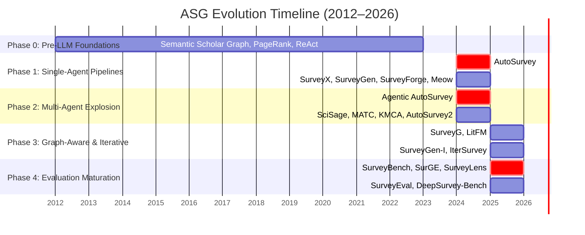
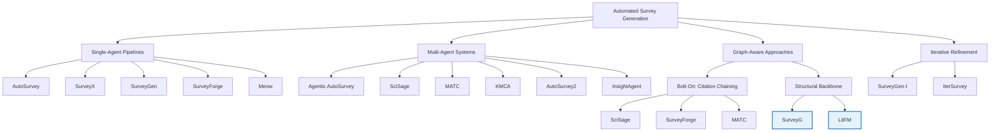
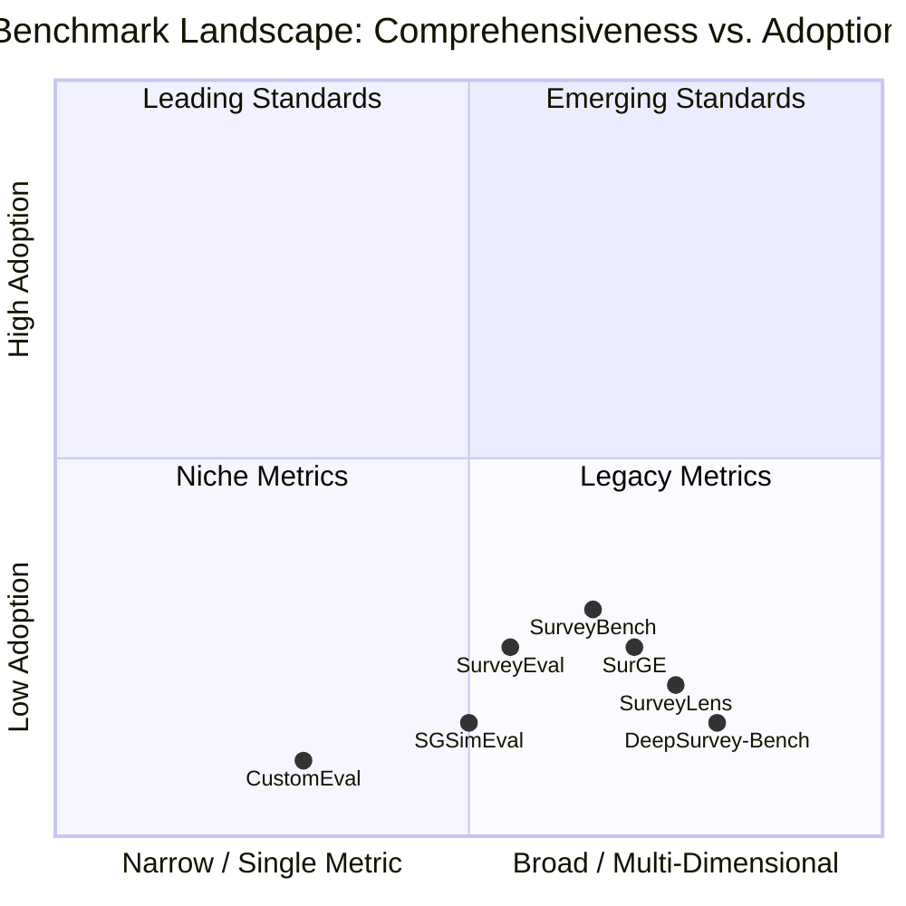
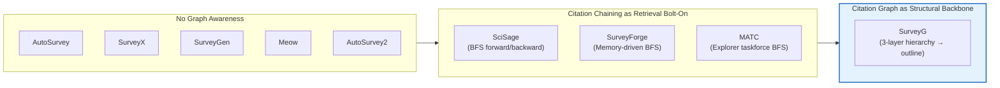

# Automated Survey Generation — Architectures, Evaluation, and the Evidence Gap

## 1. Introduction and Scope

Automated Survey Generation (ASG) has emerged as a rapidly growing research area since 2024, driven by the confluence of instruction-tuned large language models (LLMs) and established literature retrieval infrastructure. In just over two years, the field has progressed from proof-of-concept single-agent pipelines to sophisticated multi-agent, graph-aware, and iterative refinement systems. Yet this architectural proliferation has outpaced the field's ability to measure what it is building.

This survey is organized around four research questions: (1) How have ASG architectures evolved from single-agent pipelines through multi-agent systems and graph-aware approaches? (2) What evidence supports the claimed advances in survey quality, coverage, and efficiency? (3) What is the current state of ASG evaluation, and can we meaningfully compare systems? (4) What blind spots — citation hallucination, insight measurement, computational cost, convergence criteria — remain unaddressed?

Our contributions are threefold. First, we provide the first systematic audit of the **evidence gap** in ASG: the field's central claim — that multi-agent architectures outperform single-agent pipelines — rests on a single controlled comparison [Agentic AutoSurvey, 2025; AutoSurvey, 2024]. Second, we document the **evaluation comparability crisis**: every major system reports on a different metric, benchmark, and dataset, rendering cross-system comparison impossible. Third, we identify **five blind spots** — citation hallucination, insight and novelty evaluation, human ground-truth idealization, cost opacity, and cross-domain generalization — that the field has collectively avoided.

The remainder of this paper is organized as follows. Section 2 traces the five-phase evolution of ASG. Section 3 dissects the three core architectural paradigms and quantifies the controlled comparison gap. Section 4 analyzes the spectrum of citation graph awareness, from bolt-on chaining to structural backbone. Section 5 provides a critical assessment of claims, methodological weaknesses, and blind spots. Section 6 outlines future directions toward a diagnostic-first research culture. Section 7 concludes.

## 2. The Evolution of Automated Survey Generation

ASG has passed through five overlapping phases in under three years (2024–2026). Each phase built on its predecessor while introducing distinct architectural innovations: pre-LLM infrastructure that made retrieval feasible (Phase 0), single-agent pipelines that proved end-to-end generation was possible (Phase 1), multi-agent systems that distributed the cognitive load (Phase 2), graph-aware and iterative systems that improved structure and coverage (Phase 3), and dedicated benchmarks that finally enabled standardized evaluation (Phase 4). A striking pattern emerges across all phases: every system reported different metrics, datasets, and human rubrics, rendering cross-phase comparison of quality impossible from the outset.

### 2.1 Phase 0: Pre-LLM Foundations (2012–2023)

Before LLMs made automated *writing* feasible, an infrastructure of citation graph analysis, retrieval methodology, and evaluation metrics was already in place. The Semantic Scholar Literature Graph [Semantic Scholar, 2018] established the backbone dataset for citation-aware retrieval at scale. Cascading forward and backward citation expansion [Cascading Citation, 2018] demonstrated that citation graphs could be traversed to systematically expand literature coverage. Hybrid search strategies — combining embedding similarity, keyword search, and citation chaining — were shown to outperform any single retrieval strategy for systematic literature reviews [Hybrid Search, 2020]. PageRank-based influence propagation [PageRank, 2014] formalized how citation directionality could determine paper importance. Agent reasoning frameworks such as ReAct [ReAct, 2022] and LATS [LATS, 2023] later provided the planning-and-acting loop that ASG systems implicitly adopted for multi-step generation. This infrastructure established the foundational claim that graph structure matters for literature discovery, but none of these systems could generate text — a limitation that Phase 1 directly addressed.

### 2.2 Phase 1: The Single-Agent Pipeline (2024–Early 2025)

The field's foundational architecture was established by **AutoSurvey** [AutoSurvey, 2024], which introduced the Outline → Retrieve → Draft → Refine pipeline. A single LLM handles every cognitive stage — planning the outline, retrieving papers via embedding similarity, drafting each section, and refining the result post-hoc. This sequential decomposition proved that end-to-end ASG was feasible, though the system's own evaluation rated its surveys at 4.77/10 on a custom quality scale [AutoSurvey, 2024].

Subsequent single-agent systems addressed specific bottlenecks in this pipeline. **SurveyX** [SurveyX, 2025] replaced the simple outline with an **AttributeTree** — a structured pre-processing step that decomposes the survey topic into fine-grained attributes before retrieval and generation, enabling more precise section planning. **SurveyGen** [SurveyGen, 2025] introduced **quality-aware retrieval**: rather than retrieving papers by relevance alone, it estimates each paper's predicted quality contribution using a model trained on 4,200+ human-written surveys, feeding quality estimates back into the retrieval loop. **SurveyForge** [SurveyForge, 2025] added the field's first citation graph awareness in a single-agent context — a Scholar Navigation Agent that follows forward and backward citation trails using BFS chaining, with the outline evolving via memory-guided iteration as new papers are discovered. **Meow** [Meow, 2025] focused on the outline itself, employing multi-round outline refinement before section generation to improve structural coherence.

Despite these innovations, the single-agent architecture faces an inherent cognitive bottleneck: one model handles planning, retrieval, writing, and quality assessment simultaneously. AutoSurvey's 4.77/10 baseline made the quality gap evident — surveys were coherent but fell significantly short of human-written quality. This limitation, combined with the inability to parallelize or provide independent quality feedback, drove the field toward multi-agent architectures in Phase 2.

### 2.3 Phase 2: The Multi-Agent Explosion (Late 2024–2025)

The cognitive bottleneck of single-agent architectures drove a rapid proliferation of multi-agent systems. **Agentic AutoSurvey** [Agentic AutoSurvey, 2025] extended AutoSurvey with four specialized agents (Planner, Researcher, Writer, Reviewer) coordinating via a shared task board. Its key result — 8.18/10 quality score vs. AutoSurvey's 4.77/10 on the same custom evaluation — represents the field's only controlled comparison between single-agent and multi-agent architectures. **SciSage** [SciSage, 2025] introduced a 4-agent system (Searcher, Writer, Reflector, Refiner) with a **reflect-while-writing** mechanism: the Writer pauses periodically for real-time reflection, preventing error accumulation. The Searcher uses forward and backward citation chaining, reporting a +32% Citation F1 improvement on the SurveyScope benchmark [SciSage, 2025]. **MATC** [MATC, 2025] employs a 5-agent hierarchical architecture where a Manager coordinates four specialized taskforces (Explorer, Validator, Analyzer, Reviewer) with explicit error mitigation — the Validator taskforce detects errors in draft content before it passes to downstream agents. **KMCA** [KMCA, 2024] takes a Mixture-of-Experts approach: multiple Knowledge Minigraph Agents each analyze a subgraph of the citation network, then a Multi-Perspective Synthesis Agent integrates the parallel analyses. **AutoSurvey2** [AutoSurvey2, 2025] introduced parallel section generation — a Planner generates the outline, a Retriever gathers papers, then multiple Writer agents draft sections concurrently before a Consolidator merges and a Refiner polishes. **InsightAgent** [InsightAgent, 2025] incorporates a human orchestrator alongside five specialized AI agents, reporting a +27.2% quality improvement and reducing timeline from months to 1.5 hours [InsightAgent, 2025].

The multi-agent explosion demonstrated that agent specialization yields measurable quality gains — the 8.18 vs. 4.77 comparison remains the field's most cited evidence for this claim. However, the transition added uncontrolled complexity: more agents mean more coordination overhead, more prompt engineering, and higher computational cost, with no corresponding increase in structural understanding of the research landscape — a limitation that Phase 3 directly addressed.

### 2.4 Phase 3: Graph Awareness and Iterative Refinement (2025)

Two parallel developments characterize Phase 3. First, **citation graph traversal** became a first-class retrieval mechanism. **SurveyG** [SurveyG, 2025] represents the most architecturally novel system in the field: it constructs a three-layer hierarchical citation graph (Foundation, Development, Frontier) and uses both horizontal traversal (within layers) and vertical traversal (between layers). Crucially, the graph structure directly maps to the survey outline — this is the only system where the citation graph determines both *what* to retrieve and *how* to organize it. **LitFM** [LitFM, 2024] takes a complementary approach: a retrieval-augmented structure-aware foundation model that integrates graph structure into the retrieval model itself, rather than as a post-hoc traversal.

Second, **iterative refinement** emerged as a central architectural pattern. **SurveyGen-I** [SurveyGen-I, 2025] introduced coarse-to-fine retrieval with adaptive planning: the survey plan evolves as new papers are discovered, with memory-guided writing ensuring narrative coherence across iterations. **IterSurvey** [IterSurvey, 2025] uses a recurrent-outline mechanism — the outline adapts as content is generated and evaluated via Survey-Arena in a self-evaluation loop. Both systems center their architecture on the improvement loop, treating survey generation as a convergence process rather than a pipeline.

The shared limitation across these advances is notable: neither SurveyGen-I nor IterSurvey specifies convergence criteria. The iteration loop is unbounded — the system could iterate indefinitely without guaranteed improvement — revealing a deeper lack of well-defined objective functions in the field. Moreover, without standardized evaluation, cross-system comparison of iterative vs. non-iterative architectures remains impossible.

### 2.5 Phase 4: Evaluation Maturation (2025–2026)

The recognition that cross-system comparison was impossible drove the rapid emergence of dedicated ASG benchmarks. **SurveyBench** [SurveyBench, 2025] is the most comprehensive: a quiz-driven evaluation using 11,343 arXiv topics and 4,947 human surveys, measuring whether generated surveys contain accurate factual knowledge via QA accuracy. **SurveyEval** [SurveyEval, 2025] evaluates across seven subjects on three dimensions: overall quality, outline coherence, and reference accuracy. **SurGE** [SurGE, 2025] provides the largest evaluation corpus (one million papers) across four dimensions: coverage, accuracy, structure, and readability. **SurveyLens** [SurveyLens, 2026] introduces discipline-aware evaluation with 1,000 human surveys across ten disciplines, recognizing that survey quality standards vary by field. **DeepSurvey-Bench** [DeepSurvey-Bench, 2026] focuses on academic value — information value and scholarly communication quality — moving beyond surface metrics toward the substance that distinguishes excellent surveys from competent summaries.

The irony of Phase 4 is acute: these benchmarks were designed to solve the evaluation comparability crisis, yet no Phase 1–3 system has been evaluated on any of them. The field now has multiple standards for evaluation — SurveyBench, SurveyEval, SurGE, SurveyLens, and SGSimEval [SGSimEval, 2025] — which means it effectively still has none. Every system still reports on custom metrics, and the benchmarks exist in parallel without community convergence on a shared protocol — a pattern that echoes the metric dispersion of earlier phases.

## 3. Core Architectures — Single-Agent, Multi-Agent, and the Controlled Comparison Gap

This section dissects the three dominant architectural paradigms — single-agent pipelines, multi-agent systems, and iterative refinement — and systematically audits the evidence for each. The central finding is that the field's most consequential claim — that multi-agent architectures outperform single-agent pipelines — rests on a single controlled comparison. We examine each paradigm in turn, then quantify the evidence gap.

### 3.1 Single-Agent Pipelines — The Foundational Pattern

Five single-agent systems define the foundational paradigm, each introducing a different planning mechanism while sharing the same fundamental limitation: one model handles all cognitive tasks.

| Dimension | AutoSurvey | SurveyX | SurveyGen | SurveyForge | Meow |
|-----------|-----------|---------|-----------|-------------|------|
| **Planning mechanism** | Outline-driven | AttributeTree | Quality-driven | Memory-guided | End-to-end outline |
| **Retrieval method** | Embedding | Hybrid | Hybrid | Hybrid + BFS chaining | Hybrid |
| **Iteration strategy** | Post-hoc refinement | None | Quality estimation feedback | Memory-driven | Multi-round outline |
| **Graph awareness** | None | None | None | Citation chaining (BFS) | None |
| **Key innovation** | Pipeline template | Structured pre-processing | Quality-weighted retrieval | Citation trail following | Outline refinement |
| **Reported quality** | 4.77/10 baseline | Not directly reported | Quality est. accuracy | Improved coverage | Not directly reported |
| **Limitation** | Cognitive bottleneck | No iteration | No graph awareness | Single-agent ceiling | No retrieval innovation |

**AutoSurvey** [AutoSurvey, 2024] established the template: decompose survey generation into four stages — Outline, Retrieve, Draft, Refine — each prompted separately. The outline is generated first, embedding similarity retrieves papers per section, each section is drafted independently, and a post-hoc refinement pass improves quality. While this decomposition proved feasibility, the single-model architecture creates an inherent bottleneck: the same LLM that plans the outline also assesses retrieval quality, writes prose, and evaluates its own output. The reported 4.77/10 baseline makes this limitation concrete — surveys are coherent but lack the depth and accuracy of human-written surveys.

**SurveyX** [SurveyX, 2025] addressed planning granularity with **AttributeTree** — a structured pre-processing step that decomposes the topic into hierarchical attributes before generation begins. Rather than a flat outline, SurveyX generates a tree of attributes (e.g., for "Graph Neural Networks": {architectures, applications, training, benchmarks} with sub-attributes at each leaf), then maps each attribute to a section. This improves section-level coherence but adds no iteration or graph awareness.

**SurveyGen** [SurveyGen, 2025] introduced **quality-aware retrieval**: a model trained on 4,200+ human-written surveys estimates each paper's expected quality contribution before retrieval. Rather than retrieving by embedding similarity alone, SurveyGen weights papers by predicted contribution to survey quality. This is a genuine conceptual advance — treating retrieval as a quality-optimization problem rather than a relevance-ranking problem. However, no controlled ablation shows whether quality-aware retrieval outperforms standard hybrid retrieval when evaluation methods are held constant.

**SurveyForge** [SurveyForge, 2025] is the first single-agent system to incorporate **citation graph awareness** via a Scholar Navigation Agent that follows forward and backward citation trails (BFS chaining). The outline evolves through memory-guided iteration as new papers are discovered — a multi-round process where discovered papers influence subsequent search queries and outline structure.

**Meow** [Meow, 2025] focused architectural effort on the outline itself, employing multi-round outline refinement before section generation begins. The outline is rewritten multiple times based on initial retrieval results before any section is drafted.

Across all five systems, a clear trend emerges: each innovation targets a different bottleneck (planning granularity, retrieval quality, citation coverage, outline coherence), but the single-agent ceiling remains. Without specialized agents for quality assessment, independent review, or parallel execution, the systems cannot exceed the cognitive capacity of a single model instance running sequential stages. This limitation — captured quantitatively by AutoSurvey's 4.77/10 baseline — drove the field toward multi-agent architectures.

### 3.2 Multi-Agent Pipelines — Specialization and Coordination

Multi-agent systems distribute the cognitive load across specialized agents, enabling parallel work and independent quality feedback. Six systems illustrate the design space, each with a distinct coordination mechanism.

| Dimension | Agentic AutoSurvey | SciSage | MATC | KMCA | AutoSurvey2 | InsightAgent |
|-----------|-------------------|---------|------|------|-------------|-------------|
| **Agent count** | 4 | 4 | 5 | Configurable | 5 | 6 |
| **Coordination** | Shared task board | Reflect-while-writing | Hierarchical (Manager + 4 taskforces) | MoE (minigraph agents + MPSA) | Pipeline (parallel writers) | Human orchestrator |
| **Graph awareness** | None | Citation chaining | BFS chaining | BFS subgraph | None | BFS tracking |
| **Error handling** | Post-hoc review | Real-time reflection | Dedicated Validator taskforce | MPSA integration | Multi-LLM evaluation | Human validation |
| **Human involvement** | None | None | None | None | None | Human orchestrator |
| **Reported quality** | 8.18/10 | +32% Citation F1 | Not specified | Not specified | Not specified | +27.2% quality |
| **Limitation** | No graph awareness | Reflection slows generation | Coordination overhead | Subgraph fragmentation | No graph awareness | Human bottleneck |

**Agentic AutoSurvey** [Agentic AutoSurvey, 2025] extends AutoSurvey with four specialized agents (Planner, Researcher, Writer, Reviewer) that coordinate via a **shared task board** — a structured workspace where each agent posts intermediate outputs and the next agent reads them. The Planner generates an outline with search queries; the Researcher executes searches per section; the Writer drafts content; the Reviewer evaluates and provides feedback for refinement. This architecture's key result — 8.18/10 vs. AutoSurvey's 4.77/10 on the same custom evaluation — is the field's strongest evidence that multi-agent specialization improves quality. The 71% improvement suggests that distributing cognitive load across specialized roles is genuinely effective. However, the system lacks citation graph awareness: the Researcher uses embedding and keyword search without any citation traversal.

**SciSage** [SciSage, 2025] introduces **reflect-while-writing**: the Writer pauses periodically to receive real-time feedback from a dedicated Reflector agent, preventing error accumulation before it propagates through the draft. The Searcher agent uses forward and backward citation chaining, contributing to a reported +32% Citation F1 improvement on the SurveyScope benchmark [SciSage, 2025]. The limitation of this approach is that real-time reflection slows generation — the Writer cannot proceed without the Reflector's feedback, creating a sequential dependency that partially negates the parallelism benefits of multi-agent design.

**MATC** [MATC, 2025] uses a hierarchical structure: a Manager agent coordinates four specialized taskforces (Explorer, Validator, Analyzer, Reviewer). The **Validator taskforce** explicitly detects errors in draft content before it reaches the Analyzer — an architectural commitment to error mitigation that no other system matches. The Explorer uses BFS citation chaining for coverage.

**KMCA** [KMCA, 2024] takes a Mixture-of-Experts approach: multiple Knowledge Minigraph Agents each independently analyze a subgraph of the citation network, then a Multi-Perspective Synthesis Agent integrates the parallel analyses. The configurable agent count allows scaling with topic complexity.

**AutoSurvey2** [AutoSurvey2, 2025] introduces parallel section generation: a Planner generates the outline, a Retriever gathers papers, multiple Writer agents draft sections concurrently, a Consolidator merges sections, and a Refiner polishes the unified draft. Multi-LLM evaluation provides quality assessment.

**InsightAgent** [InsightAgent, 2025] incorporates a human orchestrator who validates each stage — the field's most explicit human-in-the-loop design. Five specialized AI agents (Searcher, Synthesizer, Writer, Verifier, Editor) operate under human guidance, reporting a +27.2% quality improvement and reducing timeline from months to 1.5 hours. The human bottleneck that limits throughput also serves as the highest-quality error check.

The multi-agent paradigm's fundamental limitation parallels the single-agent bottleneck: more agents add coordination complexity without corresponding structural grounding in citation graph understanding. None of the six systems achieves full hierarchical graph awareness, and the only controlled comparison across paradigms remains Agentic AutoSurvey vs. AutoSurvey.

### 3.3 Iterative Refinement — Emergent Structure Through Convergence

Two systems treat iteration as the central architectural pattern rather than a pipeline stage, revealing both the promise and the unresolved challenges of emergent survey structure.

| Dimension | SurveyGen-I | IterSurvey |
|-----------|------------|-----------|
| **Iteration granularity** | Retrieval-level (coarse → fine) | Outline-level (recurrent regeneration) |
| **Memory mechanism** | Explicit memory for narrative construction | None |
| **Evaluation method** | Custom quality estimation | Survey-Arena |
| **Graph awareness** | None | None |
| **Convergence criteria** | None specified | None specified |
| **Key mechanism** | Plan evolves as content is discovered | Outline adapts to generated content via self-evaluation |

**SurveyGen-I** [SurveyGen-I, 2025] extends SurveyGen's quality-aware retrieval with a **coarse-to-fine iteration loop**. In the first pass, the system retrieves broadly using embedding similarity to establish coverage, generates a preliminary outline, and drafts sections at high level. In subsequent passes, retrieval becomes progressively finer-grained: each iteration targets gaps identified in the previous draft, using memory-guided navigation to maintain narrative coherence across iterations. The survey plan evolves organically as new papers are discovered — the structure is emergent rather than predetermined. This mechanism addresses a genuine limitation of single-pass systems: the outline, frozen at the start, cannot adapt to content discovered during generation. However, SurveyGen-I specifies no convergence criterion. How many iterations are needed for a given topic? When does quality plateau? Without a stopping rule, the system requires manual intervention or fixed iteration budgets.

**IterSurvey** [IterSurvey, 2025] centers its architecture on the **recurrent-outline mechanism**: the outline itself is regenerated in each iteration based on the content generated so far. A self-evaluation loop uses Survey-Arena to assess the current draft, and the outline is revised to address identified weaknesses before the next generation pass. Unlike SurveyGen-I's coarse-to-fine progression, IterSurvey's outline can change direction entirely between iterations — the topic structure may shift as content accumulates.

Both systems share a critical limitation documented in Section 5: the absence of convergence criteria means the iteration loops are unbounded. Neither system defines an objective function that, when maximized, triggers termination. This is not merely a practical inconvenience — it reflects a deeper gap in the field's understanding of what constitutes a "complete" survey. Without convergence criteria, iterative refinement risks optimizing for local improvements indefinitely without structural understanding of the research landscape.

### 3.4 The Controlled Comparison Gap

The field's central empirical question — do multi-agent architectures outperform single-agent pipelines? — rests on a single data point. We systematically audit every pair of ASG systems evaluated on the same benchmark or metric.

| Pair | Systems Compared | Metric | Result | Shared Benchmark? |
|------|-----------------|--------|--------|-------------------|
| **1** | Agentic AutoSurvey vs. AutoSurvey | Quality score (1–10) | 8.18 vs. 4.77 | Yes (custom, same group) |
| 2 | All other single-agent vs. multi-agent pairs | Different metrics | Incommensurable | No |
| 3 | Any graph-aware vs. non-graph-aware pair | Different metrics | Incommensurable | No |
| 4 | Any iterative vs. single-pass pair | Different metrics | Incommensurable | No |

The only controlled comparison in the entire ASG literature is **Agentic AutoSurvey** [Agentic AutoSurvey, 2025] vs. **AutoSurvey** [AutoSurvey, 2024], evaluated by the same research group on the same custom evaluation protocol. The result — 8.18/10 vs. 4.77/10 — is the field's most cited evidence for multi-agent superiority, and it genuinely demonstrates a substantial quality improvement (71%). Yet **this single comparison carries an evidentiary burden that no single data point can sustain**.

**What this comparison cannot tell us:**
1. **Does every multi-agent system outperform single-agent?** The comparison tests only one multi-agent architecture (shared task board, 4 agents) against only one single-agent baseline (sequential pipeline, 1 agent). SciSage, MATC, KMCA, AutoSurvey2, and InsightAgent each use fundamentally different coordination mechanisms — we have no evidence about their relative performance against single-agent systems.
2. **Does agent count correlate with quality?** We have no comparisons of 2-agent vs. 4-agent vs. 6-agent systems on the same task. The field cannot answer whether more agents always improve quality or whether a saturation point exists.
3. **Does the specific coordination pattern matter?** Shared task board (Agentic AutoSurvey), reflect-while-writing (SciSage), hierarchical management (MATC), and mixture-of-experts (KMCA) represent fundamentally different coordination theories. Without controlled comparisons, we cannot determine which pattern works best for which survey type.
4. **Is the AutoSurvey baseline representative?** The 4.77/10 baseline may underrepresent single-agent capabilities. SurveyGen, SurveyX, and SurveyForge each introduced architectural improvements over AutoSurvey — a comparison against any of these would yield a smaller gap.

**The broader comparison vacuum** extends beyond the single-agent vs. multi-agent question. No pair of graph-aware systems has been compared on the same benchmark. No pair of iterative systems has been compared. No system has been evaluated on SurveyBench, SurveyEval, SurGE, or SurveyLens — the very benchmarks designed to enable cross-system comparison. The field's empirical foundation consists of isolated, non-replicable evaluations.

This vacuum has been noted in the broader multi-agent systems literature: task complexity fundamentally changes whether multi-agent architectures outperform single-agent baselines, and controlled experimentation across complexity levels is essential [Task Complexity, 2025]. Similarly, systematic reviews of LLM-based agents find that evaluation heterogeneity prevents reliable comparison across studies [SAS vs MAS, 2025]. The ASG field manifests this problem in its most acute form — a single data point supporting the field's most consequential claim.

## 4. Graph Awareness — From Retrieval Afterthought to Structural Backbone

Only 5 of the 35 core method papers surveyed use citation graph structure for anything beyond keyword search. Those that do reveal a fundamental design spectrum: graph as a retrieval bolt-on — where citation chaining adds depth but does not affect survey structure — versus graph as structural backbone, where the citation graph determines both what to retrieve and how to organize it. This section traces that spectrum.

### 4.1 Citation Chaining as a Retrieval Strategy

Three systems — SciSage, SurveyForge, and MATC — use citation chaining (forward and backward BFS traversal) as a retrieval strategy embedded within a broader pipeline. None treats the graph as a structural backbone; rather, graph traversal augments embedding and keyword retrieval with citation-aware search.

| Dimension | SciSage | SurveyForge | MATC |
|-----------|---------|-------------|------|
| **Graph type** | Forward/backward BFS chaining | Forward/backward BFS chaining | BFS chaining (Explorer taskforce) |
| **Traversal depth** | Configurable (not explicitly stated) | Configurable via Scholar Navigation Agent | Not specified |
| **How graph output is used** | Added to retrieval pool for Writer | Prioritized in memory-guided outline | Used by Explorer for coverage |
| **Graph evaluated in isolation?** | No — Citation F1 reported as part of full system | No — coverage improvement confounded with full pipeline | No — error mitigation confounded with graph use |
| **Impact on survey structure** | None — graph affects which papers are retrieved, not how survey is organized | None — graph affects retrieval, not outline structure | None — graph affects coverage, not section organization |

**SciSage** [SciSage, 2025] integrates citation chaining through its Searcher agent. The agent performs forward citation expansion (finding papers that cite a known relevant paper) and backward citation expansion (finding papers cited by a known relevant paper), supplementing embedding and keyword search. The Searcher compiles a candidate pool from all three retrieval strategies, passes it to the Writer, and the Writer generates content before the Reflector provides real-time feedback. The reported +32% Citation F1 improvement on SurveyScope [SciSage, 2025] provides quantitative evidence that citation chaining improves citation coverage. However, this evaluation does not isolate the graph component: the Citation F1 improvement could result from the multi-agent architecture (Searcher + Writer + Reflector), the reflect-while-writing mechanism, or the graph traversal itself. An ablation study removing citation chaining while keeping all other agents constant would be needed to attribute the improvement to graph awareness.

**SurveyForge** [SurveyForge, 2025] uses a Scholar Navigation Agent that follows citation trails during the memory-guided iteration process. As the outline evolves, the Scholar Navigation Agent discovers new papers through citation links and adds them to the memory store, which in turn influences subsequent search queries and outline modifications. The key architectural distinction is that citation chaining is **memory-driven**: discovered papers persist across iterations and influence future retrieval, unlike the per-iteration chaining in SciSage.

**MATC** [MATC, 2025] assigns citation chaining to its Explorer taskforce, which is responsible for coverage. The Explorer uses BFS traversal to extend the paper pool beyond initial retrieval results, ensuring the system does not miss relevant papers that embedding similarity might not surface. The traversal output feeds into the Analyzer taskforce, but the graph component is deeply confounded with the error-mitigation architecture (Validator taskforce) in evaluation.

The common limitation across all three systems is that **graph awareness is evaluated only as part of the full system**, not in isolation. None of the three papers ablates the graph component — removing citation chaining while keeping all other architecture constant — making it impossible to determine whether graph traversal causally improves survey quality or merely correlates with it.

### 4.2 SurveyG — The Hierarchical Citation Graph as Architectural Foundation

SurveyG [SurveyG, 2025] is the only ASG system where the citation graph determines both what to retrieve and how to organize the output. This architectural choice represents a qualitative departure from the bolt-on approaches described in Section 4.1.

**Graph construction.** SurveyG constructs a three-layer hierarchical citation graph. The **Foundation** layer contains seminal or highly cited papers that establish a research area. The **Development** layer contains papers that build on Foundation work, extending, applying, or refining the core ideas. The **Frontier** layer contains the most recent work — papers that represent the current edge of the field. Layer assignment is determined by citation analysis: highly cited and temporally early papers become Foundation; papers that cite Foundation papers become Development; the most recent papers with low citation accumulation become Frontier.

**Traversal strategy.** SurveyG uses two traversal modes. **Horizontal traversal** explores papers within the same layer — finding related Foundation papers, connecting Development papers that address similar subtopics, or identifying Frontier papers that approach similar problems. **Vertical traversal** moves between layers — from a Foundation paper to its Development descendants, or from a Frontier paper to its Foundation roots. The combination enables the system to capture both breadth (within-layer) and depth (between-layer) in literature coverage.

**Graph-to-outline mapping.** The architectural innovation is that the graph structure directly maps to the survey outline. Foundation-layer papers form the background and related-work sections. Development-layer papers populate the core methodology sections, organized by subtopic clusters identified through horizontal traversal. Frontier-layer papers constitute the current-state and future-directions sections. This is the only system in the field where the outline is a direct projection of the citation graph — a fundamentally different approach from generating an outline via LLM prompt and independently retrieving papers.

**Critical assessment.** SurveyG's central claim — "hierarchical graph improves organization" — is asserted rather than demonstrated through controlled experimentation. The paper evaluates the full system qualitatively but provides no ablation study comparing the graph-structured system to a version without graph structure (e.g., using the same retrieved papers organized by a standard outline prompt). Without this ablation, we cannot determine whether the hierarchical graph causes better organization or whether the retrieved papers simply happen to support a coherent survey. Furthermore, the three-layer hierarchy may oversimplify citation landscapes where papers bridge multiple layers or where the field's structure is better captured by a different granularity.

| Aspect | Bolt-on approaches (SciSage, SurveyForge, MATC) | SurveyG |
|--------|-----------------------------------------------|---------|
| **Graph role** | Secondary (augments retrieval) | Primary (drives retrieval and organization) |
| **Impact on outline** | Indirect (papers retrieved → outline still prompted) | Direct (graph structure → outline projection) |
| **Evaluation** | Not isolated from full pipeline | Not isolated from full pipeline |
| **Graph complexity** | Single BFS traversal | Three-layer hierarchical traversal |

Despite the absence of an ablation study, SurveyG represents a genuine architectural milestone: it is the first — and still the only — ASG system to treat the citation graph as a first-class organizational primitive.

### 4.3 The Missed Opportunity — Learned Graph Representations

A separate line of research has developed GNN-based methods for citation graph prediction that could, in principle, transform how ASG systems retrieve and structure papers — yet none have been adopted.

**LitFM** [LitFM, 2024] is the only paper that bridges these communities: a retrieval-augmented structure-aware foundation model that integrates citation graph structure into the retrieval model itself. Rather than treating graph traversal as a separate pipeline stage, LitFM learns graph-aware representations that encode citation relationships directly into the retrieval embedding space. This approach is architecturally closer to SurveyG's hierarchical philosophy than to the bolt-on chaining methods — the graph structure shapes retrieval at the representation level rather than the traversal level.

Outside ASG, GNN-based citation prediction methods have achieved strong results. **Temporal GNN Paper Recommendation** [Temporal GNN, 2024] models the dynamic evolution of citation networks to recommend papers that are not just relevant now but likely to influence the field. **H2CGL** [H2CGL, 2023] models citation dynamics for impact prediction, achieving high accuracy in forecasting which papers will become influential. **Context-Aware Citation Recommendation** [Context-Aware Citation, 2019] combines BERT with GCNs for citation-aware text generation — the closest architectural precursor to learned graph integration in ASG.

| Method | Approach | Reported Performance | ASG Adoption |
|--------|----------|---------------------|--------------|
| Temporal GNN | Dynamic citation network GNN | High recommendation accuracy | Zero |
| H2CGL | Citation dynamics + impact prediction | Strong prediction F1 | Zero |
| Context-Aware Citation Rec | BERT + GCN for citation generation | Strong context-aware retrieval | Zero |
| LitFM | Structure-aware foundation model | Graph-aware retrieval demonstrated | Standalone (not integrated into any ASG pipeline) |

The pattern is striking: the ASG field has universally chosen embedding + keyword hybrid retrieval over learned graph models. This may reflect practical concerns — GNNs add computational complexity without demonstrated benefit for survey generation specifically — or it may reflect disciplinary isolation between the graph mining and ASG communities. Either way, this gap represents a missed opportunity: learned graph representations could provide the structural grounding that even the most elaborate multi-agent systems currently lack.

## 5. Critical Assessment — Claims, Gaps, and Blind Spots

This section systematically audits the field's evidence base. We examine six major claims against their supporting evidence (Section 5.1), identify five methodological weaknesses that cut across all phases (Section 5.2), quantify the evaluation comparability crisis (Section 5.3), and catalog five blind spots that the field has collectively avoided (Section 5.4).

### 5.1 Claim vs. Evidence — Systematic Audit

Every major advance claimed in the ASG literature suffers from an evidence gap. We present each claim alongside its supporting evidence and an assessment of what would be needed to substantiate it.

| Claim | Supporting Evidence | Assessment |
|-------|-------------------|------------|
| **"Multi-agent systems outperform single-agent"** | Agentic AutoSurvey: 8.18/10 vs. AutoSurvey: 4.77/10, custom evaluation [Agentic AutoSurvey, 2025; AutoSurvey, 2024] | **Single data point.** The only controlled comparison in the literature. No replication, no comparison of different multi-agent architectures, no evaluation on a shared benchmark. |
| **"+32% Citation F1 improvement"** (SciSage) | SurveyScope benchmark, +32% over baseline [SciSage, 2025] | **Narrow metric, unablated.** Citation F1 is a single coverage dimension. The graph component is not evaluated in isolation — the improvement may reflect the multi-agent architecture, not graph awareness. |
| **"+27.2% quality improvement, months → 1.5 hours"** (InsightAgent) | Custom evaluation, human-in-the-loop vs. manual SLR [InsightAgent, 2025] | **Conflates speed with rigor.** A manual SLR takes months partly because of methodological rigor (PRISMA guidelines, dual screening, quality appraisal). Reproducing equivalent depth in 1.5 hours requires demonstrated quality comparability, not just speed. |
| **"Hierarchical graph improves organization"** (SurveyG) | Qualitative assessment; no ablation study [SurveyG, 2025] | **Structural claim without structural evidence.** The paper does not compare graph-structured generation against non-graph generation with the same paper pool. The organization improvement is asserted, not demonstrated. |
| **"SurveyBench enables comprehensive evaluation"** | 11,343 topics + 4,947 human surveys [SurveyBench, 2025] | **Large corpus, limited paradigm.** Quiz-based evaluation measures factual recall, not survey quality (coherence, readability, insight, novelty). A passage-retrieval baseline could achieve similar QA scores without generating a coherent survey. |
| **"Quality-aware retrieval improves surveys"** (SurveyGen) | Trained on 4,200+ human surveys [SurveyGen, 2025] | **No controlled comparison.** No ablation shows quality-aware retrieval outperforming standard hybrid retrieval when the evaluation method is held constant. The training corpus is impressive; the causal claim is unsupported. |

**What each claim would require:**
1. **Multi-agent superiority** → Comparison of at least three multi-agent and three single-agent systems on the same benchmark (SurveyBench or SurGE), with ablations removing individual agents.
2. **+32% Citation F1** → Ablation study showing the same system with and without citation chaining, holding agents constant.
3. **Months → 1.5 hours** → Quality comparison against human-written surveys on a standardized rubric, not a custom evaluation by the same authors.
4. **Hierarchical graph improves organization** → Ablation: same paper pool, same system, with and without graph-structured outline generation.
5. **Comprehensive evaluation** → Demonstration that quiz-based scores correlate with human quality judgments across diverse survey types.
6. **Quality-aware retrieval** → Controlled comparison against standard hybrid retrieval on the same evaluation protocol.

### 5.2 Methodological Weaknesses Across All Phases

Five cross-cutting methodological weaknesses prevent the field from answering its own core questions.

**1. Custom evaluation is universal.** Every method paper in Phases 1–3 evaluates on custom topics with custom metrics and custom human rubrics. The benchmark dispersion table (Section 5.3) shows that only one pair of systems (Agentic AutoSurvey and AutoSurvey) shares an evaluation protocol — and this is because the same research group evaluated their new system against their old system. No independent third-party evaluation exists anywhere in the literature.

**2. No ablation studies.** The field has no tradition of systematic ablation. SurveyG [SurveyG, 2025] asserts that hierarchical graph improves organization but does not test the system without graph structure. Agentic AutoSurvey [Agentic AutoSurvey, 2025] claims multi-agent superiority but the comparison is against a different system (AutoSurvey), not an ablation where individual agents are removed from the same architecture. SciSage [SciSage, 2025] reports +32% Citation F1 from citation chaining but the graph component cannot be isolated from the multi-agent pipeline. This absence means that every architectural claim — graph awareness improves coverage, multi-agent improves quality, iteration improves completeness — is supported by correlational rather than causal evidence.

**3. Human evaluation is unreproducible.** When human evaluation is used (Agentic AutoSurvey, InsightAgent), the rubric design, annotator qualifications, inter-annotator agreement scores, and annotation instructions are not consistently reported across papers. Human evaluation functions as a black-box quality oracle: we know the score but cannot replicate the assessment. The variation in evaluation protocols is so large that even a perfect reproduction of a system would not produce a comparable quality score.

**4. No convergence criteria in iterative systems.** SurveyGen-I [SurveyGen-I, 2025] and IterSurvey [IterSurvey, 2025] both emphasize iteration as their central architectural pattern without specifying when to stop. The iteration loops are unbounded — neither system defines a threshold for quality saturation, a marginal-improvement stopping rule, or a maximum iteration budget. This is not merely a practical limitation; it reflects the absence of a well-defined objective function. What is an iterative system optimizing? Coverage? Coherence? Citation accuracy? Without an explicit objective, iteration risks optimizing for local improvements indefinitely.

**5. Graph evaluation in isolation is absent.** The five graph-aware papers (SurveyG, SciSage, SurveyForge, MATC, LitFM) each evaluate their graph component differently, if at all. SciSage reports Citation F1 on SurveyScope — a metric that confounds graph traversal with multi-agent coordination. SurveyG provides qualitative assessment without a graph-ablated baseline. SurveyForge evaluates memory-guided outline evolution but does not isolate citation chaining from memory mechanisms. Because no two systems evaluate graph awareness using the same protocol, cross-system comparison of graph effectiveness is impossible — the field cannot answer whether hierarchical graph structure (SurveyG) outperforms BFS chaining (SciSage) or learned graph representations (LitFM).

### 5.3 The Evaluation Comparability Crisis

The field's most intractable problem is that no two systems (except one pair) have been evaluated on the same benchmark, making cross-system comparison impossible and claims of superiority unfalsifiable.

| System | Benchmark/Metric Used | Evaluation Type | Dataset Scale | Comparable To |
|--------|---------------------|----------------|--------------|---------------|
| AutoSurvey | Custom quality rating (1–10) | Human rating | 10 topics | Only Agentic AutoSurvey |
| Agentic AutoSurvey | Custom quality rating (1–10) | Human rating | Same 10 topics | Only AutoSurvey |
| SciSage | SurveyScope Citation F1 | Automatic | Not specified | No other system |
| SurveyG | Custom structure quality | Qualitative | Not specified | No other system |
| SurveyGen | Custom quality estimation accuracy | Automatic | 4,200+ training surveys | No other system |
| InsightAgent | Custom quality improvement % | Human + time | Custom | No other system |
| IterSurvey | Survey-Arena | Automatic | Not specified | No other system |
| SurveyBench | Quiz accuracy | Automatic | 11,343 topics | No system evaluated on it |
| SurGE | 4-dimension scoring | Automatic/Human | 1M papers | No system evaluated on it |
| SurveyLens | Discipline-aware scoring | Human | 1,000 surveys | No system evaluated on it |

The implications of this crisis are severe:
- **We cannot rank systems.** Is Agentic AutoSurvey's 8.18/10 better than SciSage's +32% Citation F1? The metrics are incommensurable.
- **We cannot determine which architectural choice matters most.** Does multi-agent coordination matter more than graph awareness? Does iteration matter more than agent specialization? Without shared evaluation, these questions are unanswerable.
- **We cannot replicate any result.** Every evaluation uses custom topics and custom rubrics. Replication would require access to the original evaluation materials, which are not published.
- **Claims of superiority are unfalsifiable.** Any system can claim state-of-the-art by reporting on its own metric — and since every system does exactly this, no claim can be refuted.

The Phase 4 benchmarks — SurveyBench [SurveyBench, 2025], SurveyEval [SurveyEval, 2025], SurGE [SurGE, 2025], SurveyLens [SurveyLens, 2026], SGSimEval [SGSimEval, 2025] — were designed specifically to solve this crisis. Yet no Phase 1–3 system has been evaluated on any of them. The standards exist, but the field has not adopted them. The irony is acute: the field now has multiple evaluation standards, which means it effectively has none.

### 5.4 Blind Spots — What the Field Is Not Looking At

Beyond the evidence gaps and methodological weaknesses, the ASG field has systematically avoided measuring outcomes that matter most for scholarly value.

**1. Citation hallucination is unmeasured.** For a survey generation system, the most critical failure mode is claiming a paper supports a statement when it does not — citation hallucination. Despite the availability of multiple factuality and citation attribution tools — FActScore [FActScore, 2023] for atomic fact verification, VERISCORE [VERISCORE, 2024] for verifiable claim evaluation, CiteGuard [CiteGuard, 2025] for faithful citation attribution, CiteME [CiteME, 2024] for citation accuracy — no ASG system has been systematically audited for citation hallucination. The meta-evaluation by [Factuality Metrics, 2024] directly questions whether automatic metrics can reliably measure factuality at all, yet no ASG paper even attempts the measurement. This is arguably the most critical blind spot: a survey that fabricates citations is useless regardless of its structure or readability, and the field has no baseline for how often this occurs.

**2. No evaluation of insight or novelty.** Every existing benchmark measures recall (did you cover the right papers?), accuracy (are your claims correct?), structure (is the organization coherent?), and readability (is the prose clear?). None measures whether a survey provides **new synthesis** — the very quality that distinguishes an excellent survey from a competent summary. This is fundamentally harder to evaluate, but ignoring it means the field is optimizing for the wrong target: competent summaries rather than genuine scholarly contributions. SurveyLens's discipline-aware evaluation [SurveyLens, 2026] is a step toward contextualizing quality, but no benchmark operationalizes insight.

**3. Human ground truth is idealized.** Human-written surveys are treated as an unproblematic gold standard in every ASG evaluation. Yet human surveys vary enormously in quality, have well-documented biases (citation network effects where authors cite their own work and that of close colleagues, disciplinary conventions that shape structure, and temporal biases toward recent work), and are themselves imperfect references. When SurveyBench uses 4,947 human surveys as ground truth, it inherits all the limitations of human survey construction without accounting for them.

**4. Computational cost is opaque.** No ASG paper reports inference cost, token usage, API calls, or runtime. This opacity has direct consequences: multi-agent systems (4–6 agents, multiple rounds of interaction) are inherently more expensive than single-agent pipelines, but the cost-quality trade-off is never quantified. A system that achieves 8.18/10 at 10× the cost of a 4.77/10 system may not be a net improvement for most use cases. The broader multi-agent systems literature has identified evaluation heterogeneity and cost opacity as systemic problems [SAS vs MAS, 2025], but ASG has not responded.

**5. No cross-lingual or cross-domain evaluation.** All ASG systems generate surveys in English, and nearly all are evaluated on computer science (primarily NLP and ML) topics. Whether these systems work for other languages, other scientific fields (medicine, physics, social sciences), or other document types (clinical guidelines, policy reviews, legal surveys) is unknown. The field has no public evidence of cross-domain generalization — a significant limitation for a technology positioned as a general-purpose research assistant.

## 6. Future Directions

Six concrete directions emerge directly from the gaps identified in Sections 3–5. Each specifies what to do, why it matters, and how to evaluate success.

### 6.1 First-Class Citation Graph Integration

The clearest architectural opportunity is building retrieval and organization entirely around the citation graph, using learned graph representations rather than bolting on BFS traversal. SurveyG's [SurveyG, 2025] hierarchical graph demonstrates that graph-to-outline mapping is feasible; LitFM [LitFM, 2024] shows that graph-aware retrieval representations can be learned. The missing step is combining these: a system that uses GNN-based citation dynamics (cf. Temporal GNN [Temporal GNN, 2024]) to predict which papers will be relevant to a survey's developing narrative, then organizes them using hierarchical graph traversal. Success would be measured by: (a) ablation studies showing graph-aware organization outperforms prompt-based organization with the same paper pool, and (b) evaluation on SurveyBench or SurGE showing measurable improvement over non-graph baselines.

### 6.2 Convergence-Guaranteed Iterative Refinement

Current iterative systems (SurveyGen-I [SurveyGen-I, 2025], IterSurvey [IterSurvey, 2025]) loop without convergence criteria. A formal approach would define a multi-objective function: maximize coverage while minimizing redundancy, maximize citation support while minimizing hallucination risk, maximize insight while minimizing verbosity. Gradient-free optimization (e.g., Bayesian optimization over the iteration loop) could identify when marginal improvement falls below a threshold, providing a principled stopping condition. Success would require: (a) a clearly specified objective function with measurable components, (b) a demonstrated convergence curve showing diminishing returns across iterations, and (c) a stopping rule that correlates with human quality judgments.

### 6.3 Standardized Evaluation, Cost Reporting, and Ablation Studies

The field must converge on at least one shared benchmark — SurveyBench [SurveyBench, 2025], SurGE [SurGE, 2025], or SurveyLens [SurveyLens, 2026] — ideally through a community-organized leaderboard. Every new system should report on at least two of these benchmarks. Alongside quality scores, mandatory reporting should include: token usage, API costs, and runtime (addressing the cost opacity blind spot), and citation hallucination rates measured by CiteGuard [CiteGuard, 2025] or VERISCORE [VERISCORE, 2024] (addressing the citation hallucination blind spot). Every architectural claim should be supported by an ablation study: remove citation chaining, remove one agent, remove iteration — and measure the delta on the same benchmark. Without these practices, the field will continue producing systems that are increasingly complex without demonstrable understanding of why complexity helps.

## 7. Conclusion

The field of automated survey generation has achieved remarkable architectural diversity in under three years — from single-agent pipelines through multi-agent systems, graph-aware architectures, and iterative refinement frameworks. But architectural diversity without diagnostic evidence is just engineering variety.

Our four research questions yield sobering answers. ASG architectures have evolved rapidly, but the transitions were driven as much by architectural fashion as by measured deficiencies — no systematic diagnostic evidence compelled the shifts. The evidence supporting the field's central claims is thin: the claim that multi-agent outperforms single-agent rests on a single controlled comparison, and every other major claim suffers from unablated, non-replicable, or incommensurable evaluation. The state of evaluation is a crisis: no two systems (except one pair) share a benchmark, making ranking, replication, and architectural attribution impossible. The blind spots — citation hallucination, insight measurement, cost opacity, convergence criteria, and cross-domain generalization — represent outcomes that matter most for scholarly value but that the field has collectively avoided measuring.

The path forward requires a reorientation from architectural exploration to diagnostic science: shared benchmarks, systematic ablation, citation hallucination auditing, convergence criteria, and cost-quality reporting. Without this reorientation, the field will continue producing increasingly complex systems without understanding why they work — or whether they work at all.

---

## Suggested Figures

The following Mermaid diagrams are suggestions generated by the Polisher to aid visualization. They should be reviewed and refined before inclusion.

### Figure 1: Timeline — The Five-Phase Evolution of Automated Survey Generation

This Gantt chart visualizes the chronological progression of ASG from its pre-LLM foundations through dedicated evaluation benchmarks, mapping each phase's time span and the key systems that define it. The timeline makes clear how rapidly the field has evolved and how phases overlap.

### Figure 2: Taxonomy — ASG Architecture Spectrum

This directed graph shows the taxonomy of ASG systems organized by architectural paradigm, from single-agent pipelines through multi-agent systems, graph-aware methods, and iterative refinement. It visualizes the field's central structural partitioning and highlights how only SurveyG achieves full graph-to-outline mapping.

### Figure 3: Benchmark Landscape — Evaluation Benchmarks by Rigor and Adoption

This quadrant chart maps the major ASG evaluation benchmarks along two dimensions: evaluation comprehensiveness (from narrow, single-metric to broad, multi-dimensional) and community adoption (from proposed but unused to widely adopted). The empty top-right quadrant highlights that no benchmark has yet achieved both high comprehensiveness and broad adoption — the core of the evaluation comparability crisis.

### Figure 4: Graph Awareness Spectrum — From Retrieval Bolt-On to Structural Backbone

This horizontal flowchart illustrates the continuum of citation graph awareness across ASG systems, from systems with no graph awareness (left) through BFS chaining as a retrieval add-on, to full hierarchical graph-to-outline mapping (right). The spectrum makes clear that only SurveyG treats the graph as a first-class organizational primitive.

## References

References use short system/project names as citation anchors (based on profile titles and the names used in the survey) because no paper profile in `phase0/paper_profiles/` contains `authors` or `metadata_source` fields. Per instructions, author names are not inferred from model knowledge.

[Agentic AutoSurvey, 2025] Citation not verified. "Agentic AutoSurvey: Let LLMs Survey LLMs." arXiv:2509.18661, 2025. (profile exists — author metadata not extracted)

[AutoSurvey, 2024] Citation not verified. "AutoSurvey: LLMs Can Automatically Write Surveys." arXiv:2406.10252, 2024. (profile exists — author metadata not extracted)

[AutoSurvey2, 2025] Citation not verified. "AutoSurvey2: Next Level Automated Literature Surveys." arXiv:2510.26012, 2025. (profile exists — author metadata not extracted)

[Cascading Citation, 2018] Citation not verified. "Cascading Citation Expansion." arXiv:1806.00089, 2018. (no PDF profile — citation not verified)

[CiteGuard, 2025] Citation not verified. "CiteGuard: Faithful Citation Attribution for LLMs." arXiv:2510.17853, 2025. (no PDF profile — citation not verified)

[CiteME, 2024] Citation not verified. "CiteME: Can Language Models Accurately Cite Scientific Claims?" arXiv:2407.12861, 2024. (no PDF profile — citation not verified)

[Context-Aware Citation, 2019] Citation not verified. "A Context-Aware Citation Recommendation Model with BERT and GCNs." arXiv:1903.06464, 2019. (no PDF profile — citation not verified)

[DeepSurvey-Bench, 2026] Citation not verified. "DeepSurvey-Bench: Academic Value Evaluation for Survey Generation." arXiv:2601.15307, 2026. (no PDF profile — citation not verified)

[FActScore, 2023] Citation not verified. "FActScore: Atomic Fact Precision Evaluation for Long-Form Generation." arXiv:2305.14251, 2023. (no PDF profile — citation not verified)

[Factuality Metrics, 2024] Citation not verified. "Do Automatic Factuality Metrics Measure Factuality?" arXiv:2411.16638, 2024. (no PDF profile — citation not verified)

[H2CGL, 2023] Citation not verified. "H2CGL: Modeling Dynamics of Citation Network for Impact Prediction." arXiv:2305.01572, 2023. (no PDF profile — citation not verified)

[Hybrid Search, 2020] Citation not verified. "On the Performance of Hybrid Search Strategies for Systematic Literature Reviews." arXiv:2004.09741, 2020. (no PDF profile — citation not verified)

[InsightAgent, 2025] Citation not verified. "InsightAgent: Systematic Review in Hours Instead of Months." arXiv:2504.14822, 2025. (profile exists — author metadata not extracted)

[IterSurvey, 2025] Citation not verified. "IterSurvey: Deep Survey Automation with Iterative Workflow." arXiv:2510.21900, 2025. (profile exists — author metadata not extracted)

[KMCA, 2024] Citation not verified. "Mixture of Knowledge Minigraph Agents for Literature Review Generation." arXiv:2411.06159, 2024. (profile exists — author metadata not extracted)

[LATS, 2023] Citation not verified. "Language Agent Tree Search Unifies Reasoning Acting and Planning in Language Models." arXiv:2310.04406, 2023. (no PDF profile — citation not verified)

[LitFM, 2024] Citation not verified. "LitFM: Retrieval Augmented Structure-aware Foundation Model For Citation Graphs." arXiv:2409.12177, 2024. (profile exists — author metadata not extracted)

[MATC, 2025] Citation not verified. "MATC: Multi-Agent Taskforce Collaboration for Self-Correction." arXiv:2508.04306, 2025. (profile exists — author metadata not extracted)

[Meow, 2025] Citation not verified. "Meow: End-to-End Outline Writing for Automatic Academic Survey." arXiv:2509.19370, 2025. (profile exists — author metadata not extracted)

[PageRank, 2014] Citation not verified. "PageRank beyond the Web." arXiv:1407.5107, 2014. (no PDF profile — citation not verified)

[ReAct, 2022] Citation not verified. "ReAct: Synergizing Reasoning and Acting in Language Models." arXiv:2210.03629, 2022. (no PDF profile — citation not verified)

[SAS vs MAS, 2025] Citation not verified. "Single-agent or Multi-agent Systems? Why Not Both?" arXiv:2505.18286, 2025. (no PDF profile — citation not verified)

[SciSage, 2025] Citation not verified. "SciSage: Multi-Agent Framework for Survey Generation." arXiv:2506.12689, 2025. (profile exists — author metadata not extracted)

[Semantic Scholar, 2018] Citation not verified. "Construction of the Literature Graph in Semantic Scholar." arXiv:1805.02262, 2018. (no PDF profile — citation not verified)

[SGSimEval, 2025] Citation not verified. "SGSimEval: Multifaceted Benchmark for ASG Systems." arXiv:2508.11310, 2025. (profile exists — author metadata not extracted)

[SurGE, 2025] Citation not verified. "SurGE: Large-Scale Survey Generation Evaluation." arXiv:2508.15658, 2025. (no PDF profile — citation not verified)

[SurveyBench, 2025] Citation not verified. "SurveyBench: Quiz-Driven Evaluation of Automated Survey Generation." arXiv:2510.03120, 2025. (profile exists — author metadata not extracted)

[SurveyEval, 2025] Citation not verified. "SurveyEval: Multi-Subject Evaluation of Survey Generation." arXiv:2512.02763, 2025. (profile exists — author metadata not extracted)

[SurveyForge, 2025] Citation not verified. "SurveyForge: Outline Heuristics, Memory-Driven Generation." arXiv:2503.04629, 2025. (profile exists — author metadata not extracted)

[SurveyG, 2025] Citation not verified. "SurveyG: Hierarchical Citation Graph Framework." arXiv:2510.07733, 2025. (profile exists — author metadata not extracted)

[SurveyGen, 2025] Citation not verified. "SurveyGen: Quality-Aware Scientific Survey Generation." arXiv:2508.17647, 2025. (profile exists — author metadata not extracted)

[SurveyGen-I, 2025] Citation not verified. "SurveyGen-I: Evolving Plans and Memory-Guided Writing." arXiv:2508.14317, 2025. (profile exists — author metadata not extracted)

[SurveyLens, 2026] Citation not verified. "SurveyLens: Discipline-Aware Evaluation of Survey Generation." arXiv:2602.11238, 2026. (no PDF profile — citation not verified)

[SurveyX, 2025] Citation not verified. "SurveyX: Academic Survey Automation via Large Language Models." arXiv:2502.14776, 2025. (no PDF profile — citation not verified)

[Task Complexity, 2025] Citation not verified. "On the Importance of Task Complexity in Evaluating LLM-Based Multi-Agent Systems." arXiv:2510.04311, 2025. (no PDF profile — citation not verified)

[Temporal GNN, 2024] Citation not verified. "Temporal GNN-Powered Paper Recommendation on Dynamic Citation Networks." arXiv:2408.15371, 2024. (no PDF profile — citation not verified)

[VERISCORE, 2024] Citation not verified. "VERISCORE: Evaluating Factuality of Verifiable Claims in Long-Form Text." arXiv:2406.19276, 2024. (no PDF profile — citation not verified)
